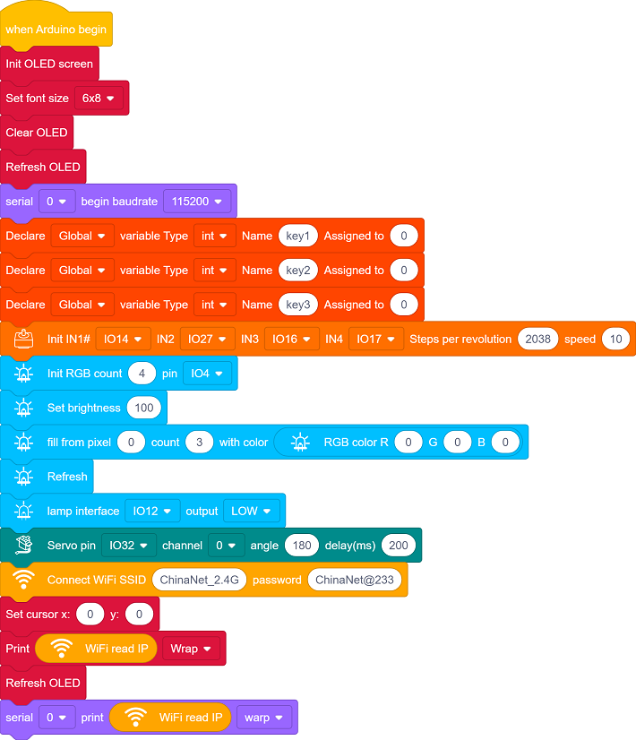
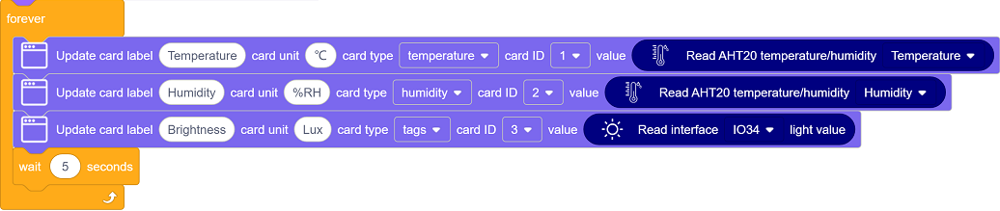
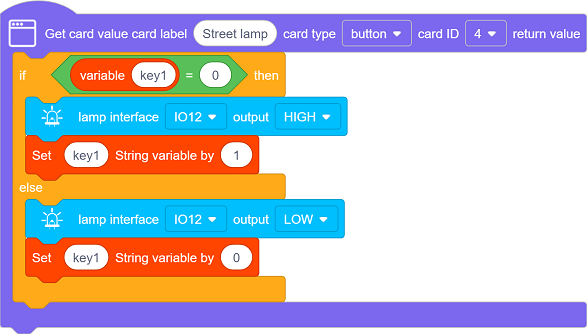
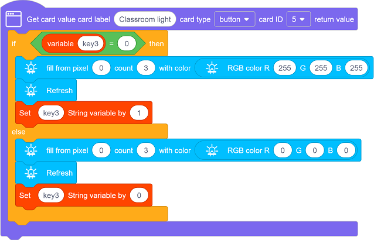
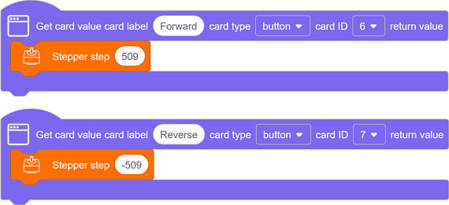
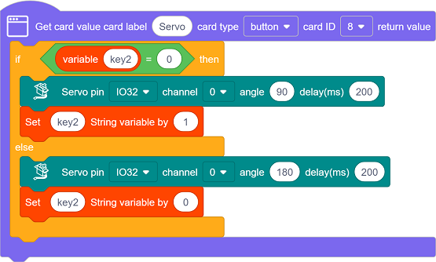
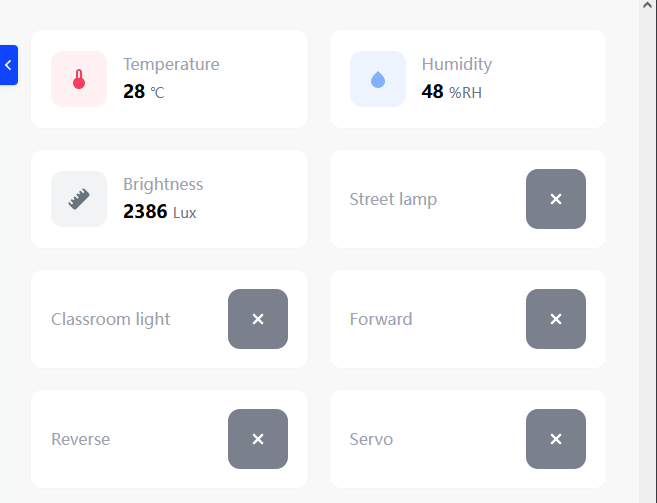
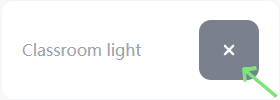
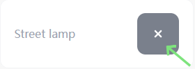

## 15. 智慧校园

本智慧校园课程将指导您开发一个集环境监测与设备控制于一体的物联网应用系统。通过网页端实时监控教室内的温湿度、光照强度等环境数据，并支持远程控制窗帘开关、教室灯与路灯的明灭以及校门启闭状态。一起来助力绿色智慧校园建设吧！

#### 流程图

#### 实验代码

#### 代码说明

**注意：此课程涉及HTML、CSS、JS等课外知识， 只做简单介绍。**

单击页面左下角的

在搜索框输入名称，单击添加库：

单击 Back 返回编程页面。

- OLED屏、串口初始化、RGB LED灯初始化、LED灯初始化、舵机初始化

- 设置WiFi账号密码，连接WiFi，等待连接成功将IP地址打印在OLED屏和串口监视器。

  注意：请将代码里的 WiFi 名称和密码替换为你的。

- 配置页面的组件1、组件2和组件3
  - 组件1：实时显示当前温度值
  - 组件2：实时显示当前湿度值
  - 组件3：实时显示室内光照值
- 每5秒更新一次数据。

- 组件4：点击按钮控制路灯亮灭

- 组件5：点击按钮控制教室灯亮灭

- 组件6：每按一次控制窗帘拉开509步
- 组件7：每按一次控制窗帘关闭509步

- 组件8：点击按钮控制校园大门打开和关闭

#### 实验结果

1. 上传代码前打开串口监视器，设置波特率为115200。代码上传成功后可以看到打印的IP信息：

   

   OLED屏上同步打印IP信息：

   

2. 将**你的IP地址**输入到手机/电脑浏览器并打开，即可访问智慧校园页面。

   注意：确保手机/电脑与ESP32连接到同一个 WiFi 。

可以看到实时显示温度值、湿度值和室内光照值，方便我们监测教室内的情况。

按下 ，缓慢调节拉开窗帘。

按下，缓慢调节关闭窗帘。

按下，打开教室灯。

按下，打开校园路灯。

按下，控制校园大门的开关。

#### 常见问题解决

1. 若串口监视器无任何信息打印，请按下主板的复位键：

   

2. 若ESP32 一直没有获取到 IP 地址，通常是因为 WiFi 连接失败，解决办法：

   - 确保代码里的 WiFi 名称和密码已经替换为你的。
   - 确保你的 WiFi 网络是 2.4GHz 的，ESP32不支持 5GHz WiFi。

3. 若输入IP地址无页面，解决办法：

   - 确保IP地址输入正确。
   - 检查手机/电脑是否与ESP32在同一网络。

