## 6. 智能篮球计分器

让我们用红外避障传感器和 OLED 屏打造一个智能篮球计分器，通过精准检测进球并实时显示比分，体验科技与体育的完美结合！

### 6.1 红外避障传感器

这款红外避障传感器是一种基于红外原理的检测设备，能够实时感知前方障碍物的距离，广泛应用于机器人、智能小车和自动避障系统中。

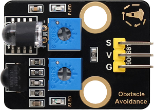

#### 参数

工作电压 : DC 5V 

电流 : 50 mA

最大功率 : 0.3 W

工作温度 ：-10°C ~ +50°C

输出信号 : 数字信号

感应距离 : 2 ~ 40 cm

尺寸 ：32 x 23 x 12mm

定位孔大小 ：直径为 4.8 mm

接口 ：间距2.54 mm，3pin弯针接口

#### 原理

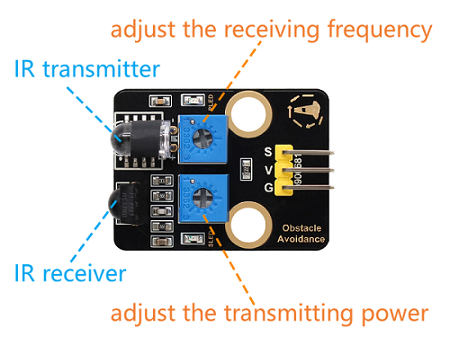

**工作原理：**

1. 发射红外光：
   - 红外发射管发射一束红外光。
2. 接收反射光：
   - 如果前方有障碍物，红外光会被反射回来，被红外接收头接收。
3. 信号处理：
   - 传感器内部的电路根据接收到的反射光强度判断障碍物的距离。
   - 输出信号为数字信号（高电平或低电平）。

红外避障传感器受环境光干扰较大，检测距离较短（通常为 2cm ~ 30cm）。

**调节传感器灵敏度：**

调节红外避障模块上的电位器可以改变传感器的灵敏度和检测距离。以下是调节步骤和注意事项。

调节前先将收球框摆放至篮筐下。

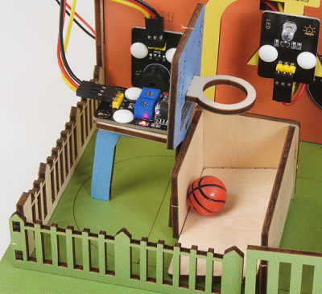

首先，将两个电位器调到中间位置（默认状态）。

先调节发射功率，将电位器顺时针到尽头，然后逆时针慢慢往回调，微调使传感器上SLED灯介于刚刚亮与不亮之间的不亮状态。

接着设置接收频率，同样将电位器顺时针到尽头，然后逆时针慢慢往回调，微调使传感器上SLED灯介于刚刚亮与不亮之间的不亮状态。

调节完毕，可以开始使用了。投球测试，当篮球掉入篮筐的一刹那，能看到SLED灯亮起。

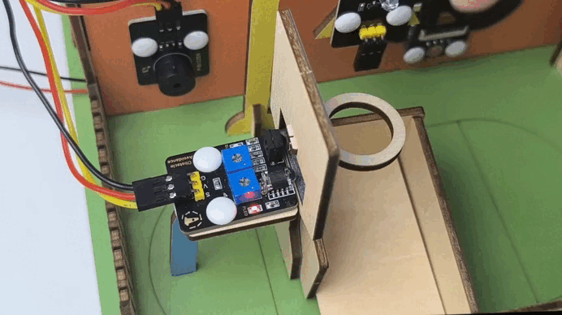

若调节时保持传感器探头前方**远离障碍物**或**没有障碍物**阻挡，能将检测距离调整到**最大**。

#### 实验代码

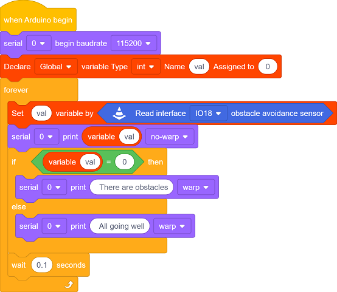

#### 代码说明

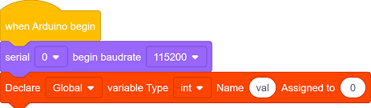

- 串口初始化，定义变量 `val` 用来记录红外避障模块的输出信号

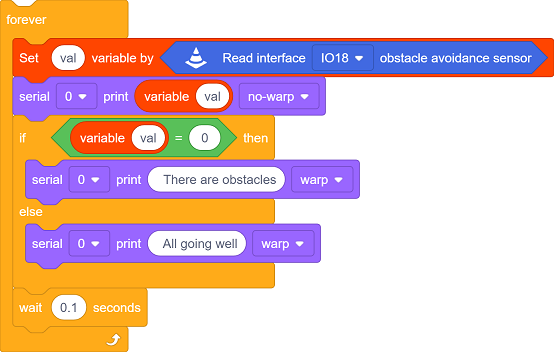

- 读取红外避障模块的输出信号。

  - `0`：检测到障碍物。

  - `1`：未检测到障碍物。

- 根据信号判断是否有障碍物：

  - 如果检测到障碍物，输出 `There are obstacles`。
  - 如果未检测到障碍物，输出 `All going well`。

- 每0.1秒更新一次。

#### 实验结果

代码上传成功后，单击, 波特率选择115200 。

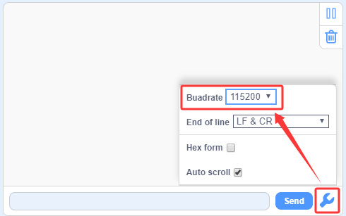

- 当未检测到障碍物时，输出 `1` 和 `All going well`。
- 当检测到障碍物时，输出 `0` 和 `There are obstacles`。

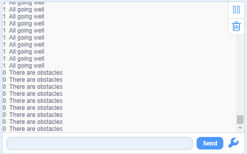

---

### 6.2 智能篮球计分器

在前面的课程中，我们已经学习了红外避障传感器和 OLED 屏的基本原理与使用方法。现在，让我们将这些知识结合起来，动手制作一个智能篮球计分器！通过这个项目，我们将实现一个能够精准检测进球并实时显示比分的智能系统，既提升比赛体验，又充满科技感。

接下来，我们将一步步完成硬件连接、代码编写和功能调试，最终打造出一个实用的智能篮球计分器。让我们一起开启这段充满创意与挑战的旅程吧！

#### 流程图

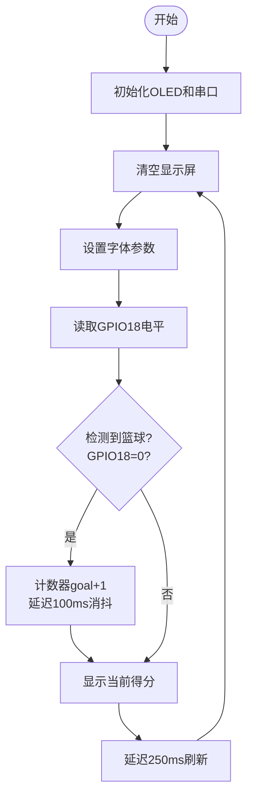

#### 实验代码

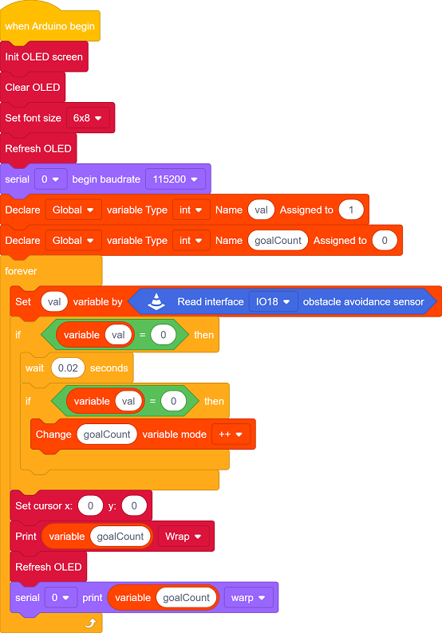

#### 代码说明

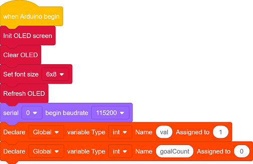

- OLED初始化、清屏、定义字体大小、刷新显示
- 串口初始化
- 定义变量 `val` ，用来记录红外避障模块的输出信号
- 定义变量 `goalCount` ，用来记录数值

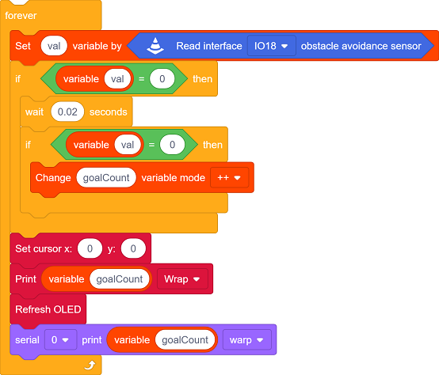

- 当传感器检测到物体时，产生下降沿信号（电平1→0）

  通过**时间差消抖**（20ms间隔）：

  - 如果两次触发间隔 > 20ms → 视为有效触发，`goalCount`计数加一
  - 否则视为抖动噪声，忽略此次触发

- OLED屏上显示 `goalCount` 的值。

- 串口监视器显示显示 `goalCount` 的值。

#### 实验结果

代码上传成功后，将收球框摆放至篮球架下，确保篮球不会掉落至其他地方。

我们将篮球投入篮筐，进球时：

- 分数加 1。

- OLED 屏幕实时显示当前得分。

**注意：**红外避障传感器对环境光敏感，尽量在光线稳定的环境中使用。

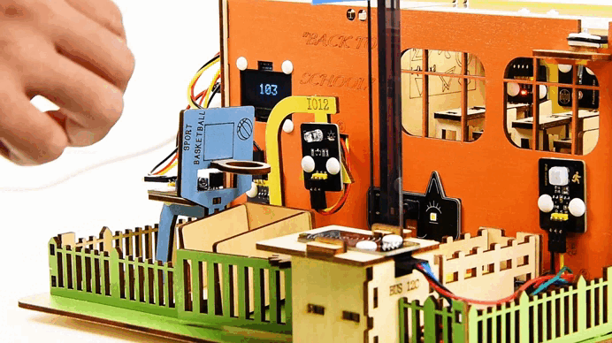

---

