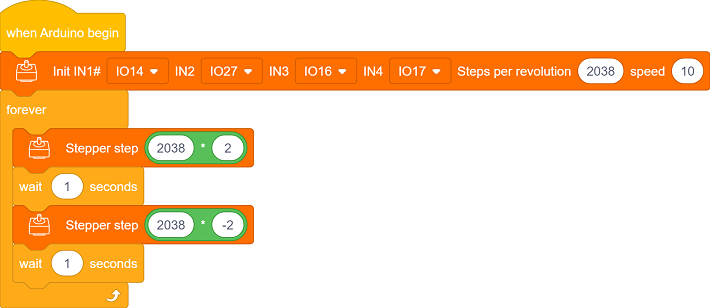
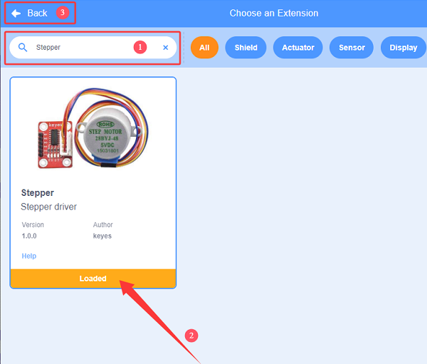
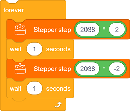
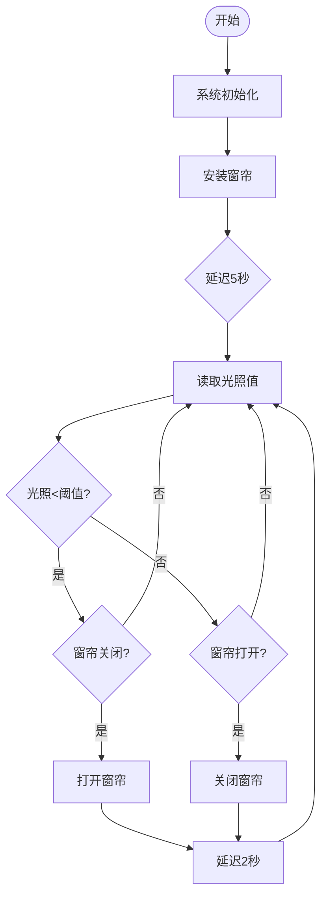
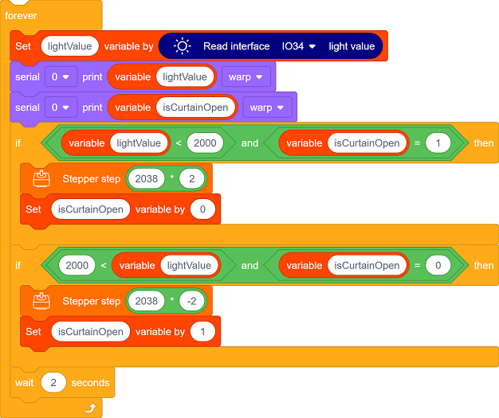

## 9. 光控自动窗帘

这节课我们要制作一个智能光控自动窗帘系统，当光线变强时，光敏传感器会像敏锐的眼睛一样察觉变化，步进电机就会自动拉开窗帘；光线变暗时，它又会悄悄合上窗帘，就像一个贴心的光线小管家！

### 9.1 步进电机

28BYJ-48是一款经济实用的5线4相减速步进电机，内置1/64减速齿轮箱，提供高扭矩和精准的步进控制，常被用于智能家居、教学实验和小型自动化项目。

#### 参数

工作电压 ：DC 5V 

相数 ：4相（5线制：4相+1公共端）

绕组电阻 ：50Ω±10%（每相）

驱动方式 ：单极驱动

减速比：1：64

输出轴步距角：5.625°

理论步数：64步（输入轴）→4096步/转（输出轴）

实际常用步数：2038步/转（因齿轮间隙的工程近似值）

电机直径：28mm

轴长：8mm（输出轴）

重量：约30g

线序：红(COM)、橙(A)、黄(B)、粉(C)、蓝(D)

#### 原理

**1. 电机基本结构**

28BYJ-48 是单极式永磁步进电机（带减速齿轮箱），包含：

- 定子：4组线圈（8个引出线）
- 转子：永磁体（经齿轮箱减速输出）
- 减速比：1:64（实际输出轴转1圈，转子需转64圈）
- 步距角：5.625°/64 ≈ 0.088°/步（经减速后）

**2. 驱动原理核心**

通过按顺序激励定子线圈产生旋转磁场，吸引永磁转子转动：

**线圈连接方式（单极5线式）：**

共5根线：4个线圈端 + 1个公共端

**工作模式**：

全步模式：每次只激活一个线圈（2048步/圈），步距角5.625°，64步/圈（转子）

- 例：A → B → C → D → A...（正转）
- 例：A → D → C → B → A...（反转）

1. 避免堵转：可能烧毁线圈
2. 最低转速限制：低于5RPM可能出现抖动
3. 需配合消抖电路：机械齿轮存在回差
4. 不要直接拔插电线：可能产生反电动势

#### ULN2003驱动模块

由于驱动 28BYJ-48 步进电机需要300mA以上的大电流，而ESP32主板的GPIO引脚最大只能输出40mA的小电流，所以需要ULN2003驱动板来放大电流信号并保护主板。

#### 实验代码

#### 代码说明

需要添加步进电机库才能使用。

单击页面左下角的

在搜索框输入 `Stepper` ，单击添加，单击 Back 返回编程页面。

添加成功：

- 初始化步进电机，定义 IN1-IN2-IN3-IN4 引脚，实际步数/圈，转速(RPM)，建议5-12，超过15极易堵转

- 先正转2圈，停顿1秒
- 再反转2圈，停顿1秒
- 循环执行上述过程

#### 实验结果

上传代码前请先将窗帘调整至下图所示位置。

代码上传成功后，循环执行以下操作：

- 步进电机转动，窗帘打开，停顿1秒
- 步进电机转动，窗帘关闭，停顿1秒

#### 常见问题解决

1. 电机不转
   - 检查供电是否充足；引脚是否正确连接
2. 电机抖动
   - 适当降低转速
4. 电机发热严重
   - 减少连续运行时间

### 9.2 光控自动窗帘

在前面的学习中，我们已经掌握了光敏传感器检测光照强度的原理和步进电机的精准控制功能。在这节课中，我们将这些技术结合起来，动手制作一个智能光控窗帘系统！通过光敏传感器实时监测教室内光照强度，当检测到阳光过强时，系统会自动控制步进电机关闭窗帘；当光线变弱时，窗帘又会自动打开。这个系统就像一位贴心的教室管理员，既能保护师生免受强光干扰，又能智能调节室内光线环境。让我们一起来打造这个既实用又充满科技感的智能装置吧！

#### 流程图

#### 实验代码

#### 代码说明

需要添加步进电机库才能使用。

单击页面左下角的

在搜索框输入 `Stepper` ，单击添加，单击 Back 返回编程页面。

添加成功：

- 定义变量 `isCurtainOpen` ，用于记录窗帘当前的物理状态，初始值为1。
- 定义变量 `lightValue ` ，用于存储光敏传感器读取的实时光照强度值。
- 初始化串口监视器
- 初始化步进电机

- 读取实时光照强度值。
- 双条件判断确保只在状态需要改变时才动作：
  - 只有光照强度值小于2000且`isCurtainOpen` = 1时，电机正转2圈。`isCurtainOpen`状态更新为0，保证软件状态与实际物理状态同步。
  - 只有光照强度值大于2000且`isCurtainOpen` = 0时，电机反转2圈。`isCurtainOpen`状态更新为1，保证软件状态与实际物理状态同步。
- 每2秒刷新一次

#### 实验结果

上传代码前请先将窗帘调整至下图所示位置。

根据教室内的光照值，窗帘自动作出相应的动作：

- 光线不足且窗帘关闭时，打开窗帘
- 光线充足且窗帘打开时，关闭窗帘