## MicroPython 开发环境

在开始构建项目之前，你需要首先做一些准备，这是非常重要的，你不能跳过。

### **1. 安装Thonny(重要)**

Thonny是一个免费、开源的软件平台，体积小，界面简单，操作简单，功能丰富，是一个适合初学者的Python IDE。在本教程中，我们使用这个IDE在整个过程中开发ESP32。Thonny支持多种操作系统，包括Windows, Mac OS,  Linux。

**1. 下载Thonny软件：**

进入软件官网：[https://thonny.org](https://thonny.org) 下载Thonny软件，根据你的计算机系统选择对应的系统版本下载。

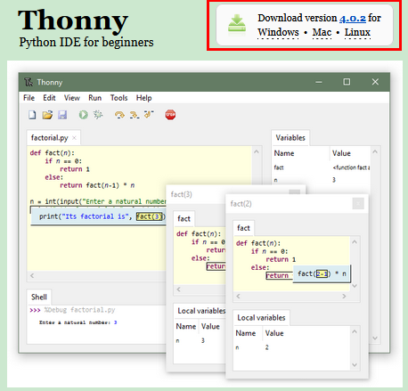

**2. Windows上安装Thonny软件（以4.0.2版本为例）：**

A\. 下载后的Thonny图标如下。

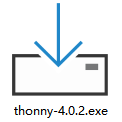

B\. 双击 “**thonny-4.0.2.exe**”，会出现下面对话框，我这里是选择  进行操作的。你也可以选择  进行操作的。

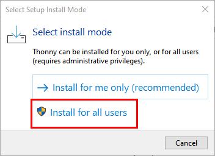

C\. 如果您不熟悉电脑软件安装，您可以一直单击 “**Next**” 直到安装完成。

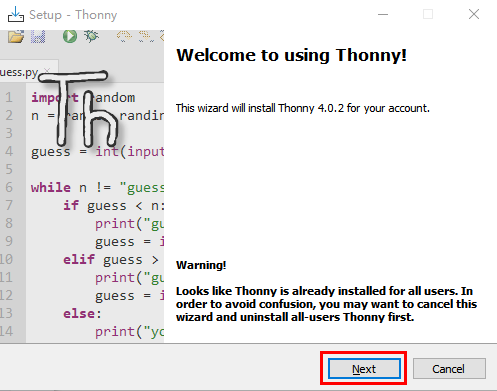

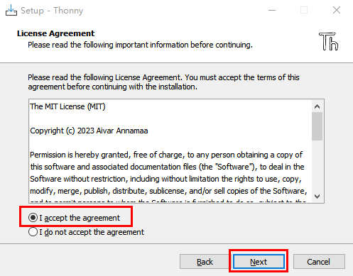

D\. 如果您需要更改Thonny软件的安装路径，可以单击 “**Browse...**” 进行修改。选择安装路径后，单击 “**OK**”。

如果您不想更改安装路径，只需单击 “**Next**”；然后又继续单击 “**Next**”。

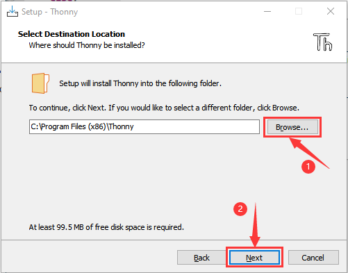

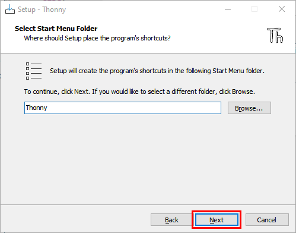

E\. 选中 “**Create desktop icon**”，Thonny软件会在你的桌面上生成一个快捷方式，方便你稍后打开Thonny软件。

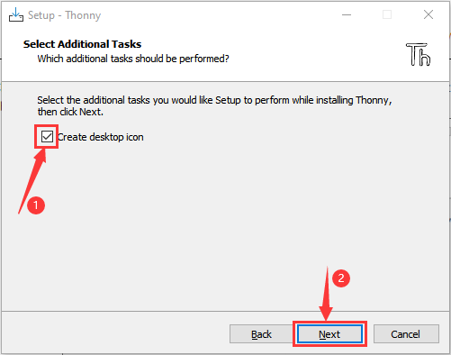

F\. 单击 “**Install**” 安装软件。

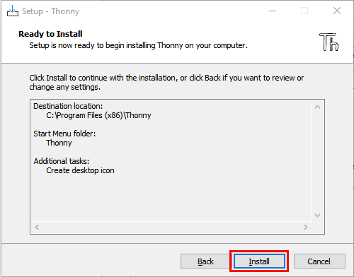

G\. 在安装过程中，您只需等待安装完成，千万不要点击 “**Cancel**”，否则将无法安装成功。

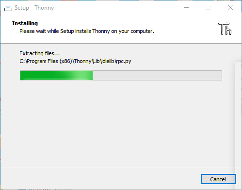

H\. 一旦看到如下界面，就表示已经成功安装了Thonny软件，点击 “**Finish**” 就可以。

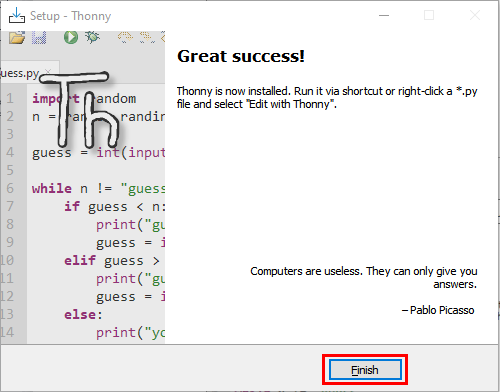

I\. 如果你在安装过程中选择了 “**Create desktop icon**”，则可以在桌面上看到如下图标。

### **2. Thonny软件基本配置** 

A\. 双击Thonny软件的桌面图标，可以看到如下界面，同时还可以进行语言选择(这里选择简体中文)和初始设置。设置完了点击 “**Let’s go！**”。

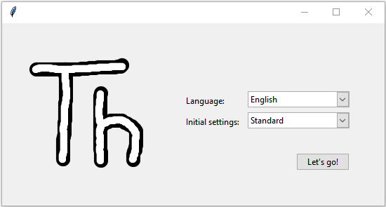

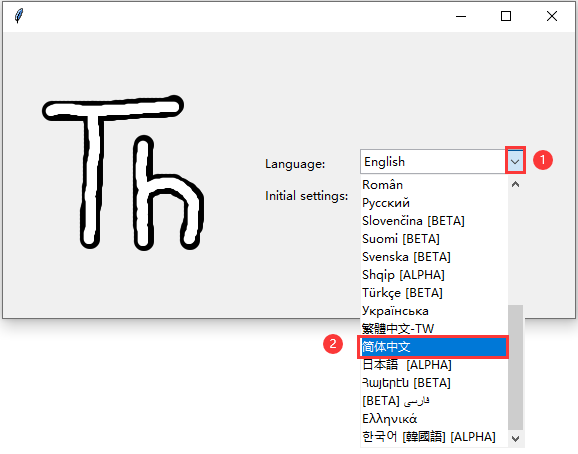

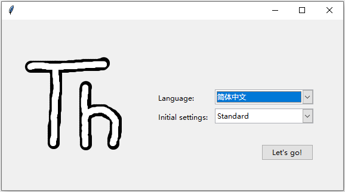

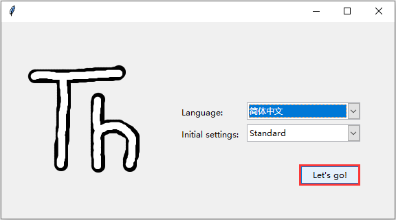

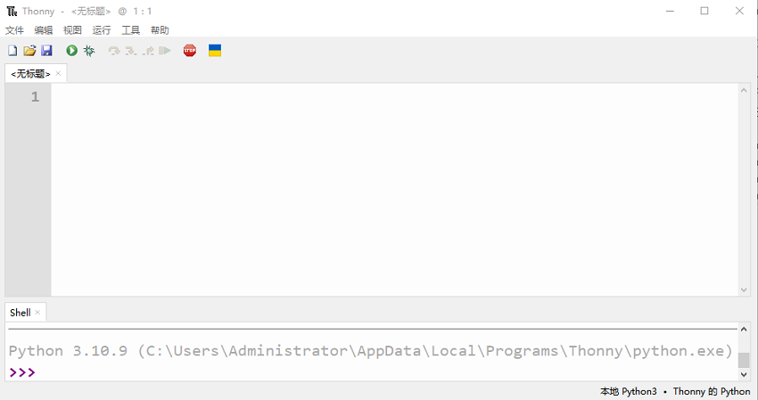

B.\. 选择 “**视图**” → “**文件**” 和 “**Shell**”。

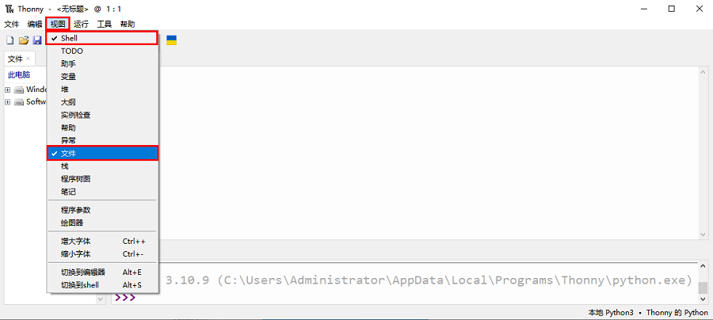

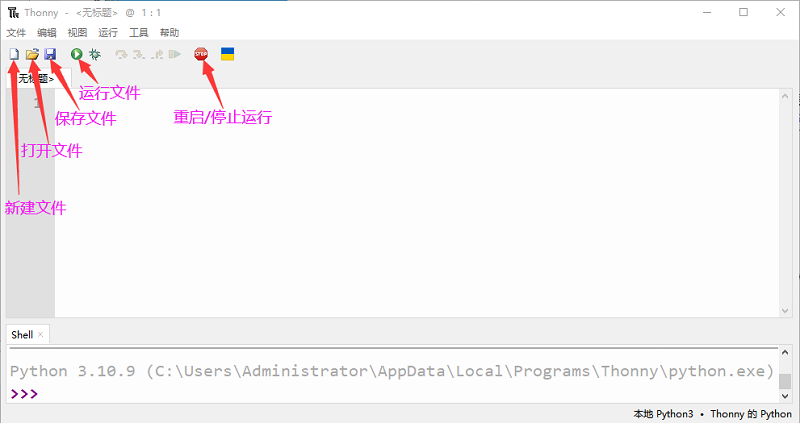

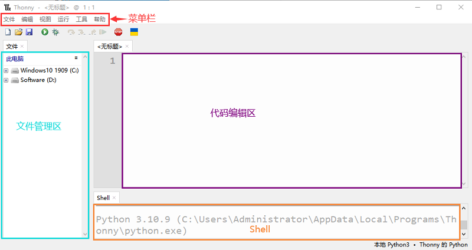

### **3. 烧入Micropython固件(重要)**

要在ESP32主板上运行Python程序，我们需要先将固件烧入到ESP32主板。

**下载Micropython固件：**

网页列出microPython的ESP32固件：[https://micropython.org/download/esp32/](https://micropython.org/download/esp32/)

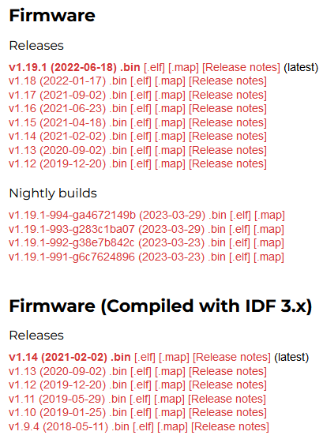

我们可以从上面选择最新版本固件烧录，当然如果出错也可以选择python教程开头资料下载链接提供的固件，即本教程中使用的固件：esp32-20210902-v1.19.bin

**烧入Micropython固件：**

用USB线连接计算机和ESP32主板。

1\. 打开Thonny IDE，点击 “**运行**” ，选择 “**配置解释器**”。

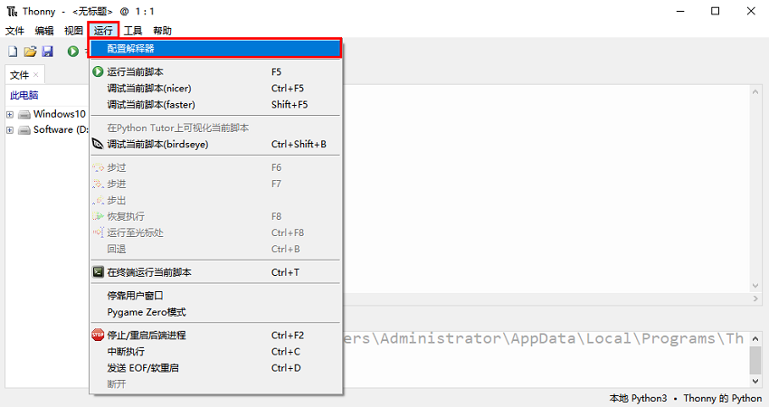

2\. 选中 “**MicroPython (ESP32)**”，选中 “**Silicon Labs CP210x USB to UART Bridge(COMX)**”，然后点击 “**安装或更新MicroPython**”。(注意：端口选择带有Silicon Labs CP210x USB to UART Bridge的选项即可，后面的COMX不同电脑设备会不同，不必纠结于此)

这里如果没有Silicon Labs CP210x USB to UART Bridge的选项，请检查数据线是否连接到位，更换电脑的USB接口和数据线（可以使用手机充电线）并且重启编程软件重新测试，最后如果依旧无法识别请参照教程的《驱动安装》教程

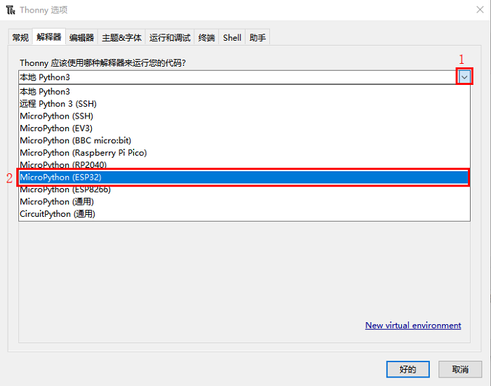

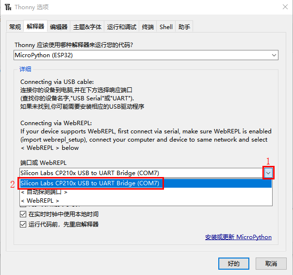

**注意：** 这里需要稍等一会下面一步的选择才可以选择。

3\. 弹出如下对话框，“**Port**” 选择 “**Silicon Labs CP210x USB to UART Bridge**”，单击 “**Browse...**” 选择之前准备好的microPython固件。检查 “**Erase flash before installing**” 和 “**Flash mode**”，然后点击 “**安装**”，等待安装完成提示。（注意：如果安装固件失败，请再次点击 “**安装**”，然后按住ESP32主板上的Boot键 ，出现上传进度百分比再松开Boot键。)

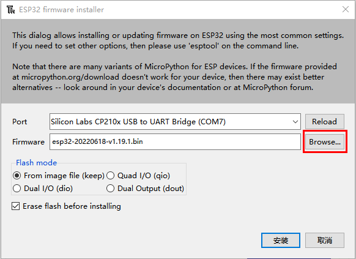

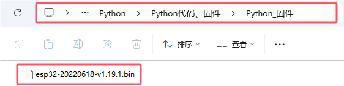

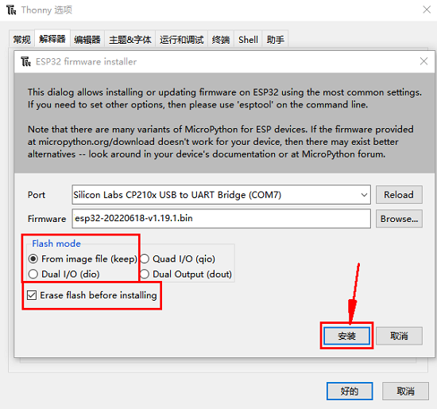

在新版本软件中，界面有所变化，并且固件的烧录方法也有所变化，请按照你安装的软件实际界面进行操作，以下是新版本两种不同操作方法

**方法一：** 直接通过软件烧录固件（固件不需要另外下载）

按照下面标记选择好后点击 “**安装**”，然后等待。（如果失败请下载固件直接烧录）

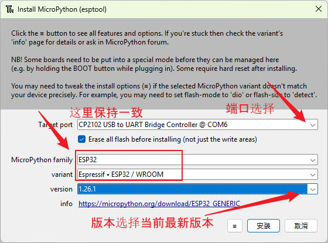

**方法二：** 直接烧录固件

选择好端口后找到下载的固件，选择固件后不要再进行任何修改，点击 “**安装**” 等待即可

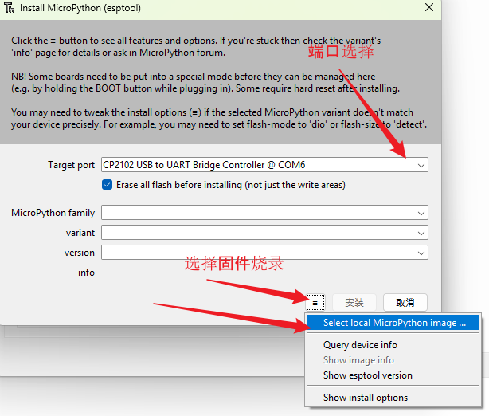

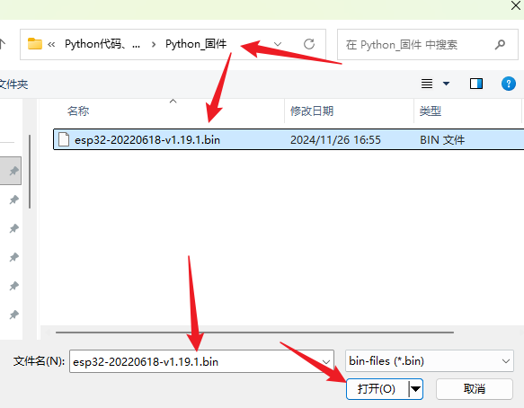

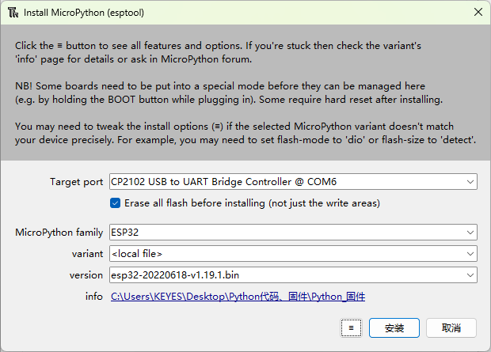

4\. 等待安装完成。安装完成后先点击 “**关闭**” 再点击 “**好的**” 就行。

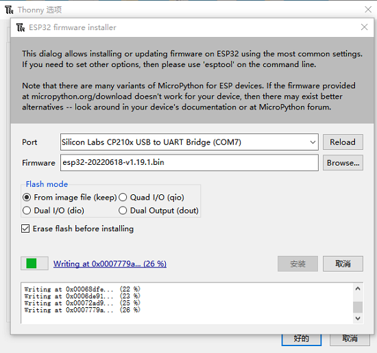

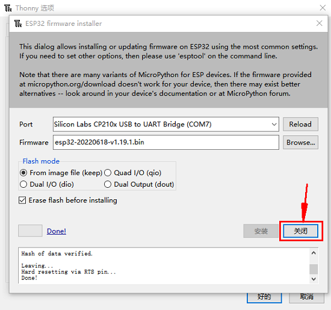

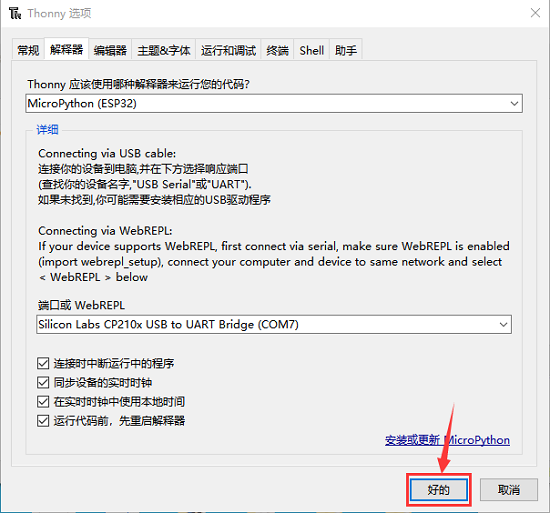

5\. 关闭所有对话框，转到主界面，点击 。如下图所示：

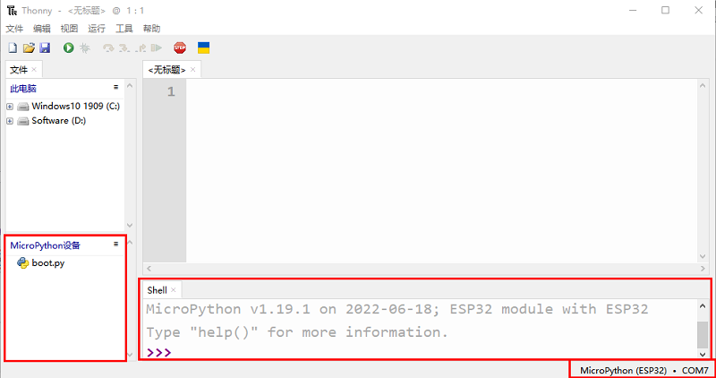

6\. 到目前为止，一切准备工作都已就绪。

### **4. 测试代码**

**测试Shell命令：**

在 “**Shell**” 窗口中输入 “**print('hello world')**” 并按 **Enter键**。

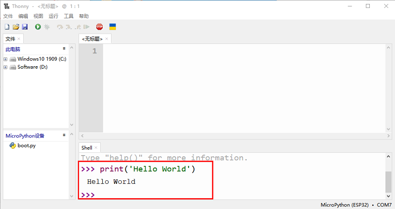

**在线运行：**

ESP32需要连接到计算机时，它是在线运行。用户可以使用Thonny IDE编写和调试程序。

1\. 打开Thonny并单击  “**打开**”。

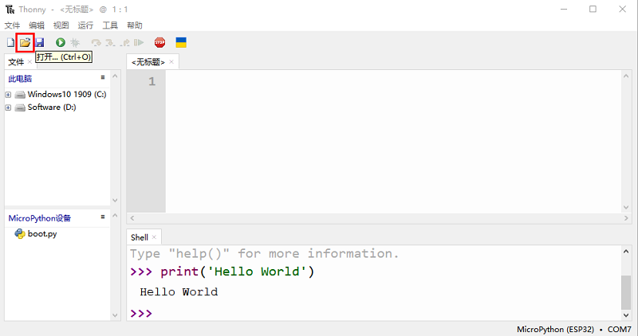

2\. 在新弹出的窗口中，单击 “**此电脑**”。

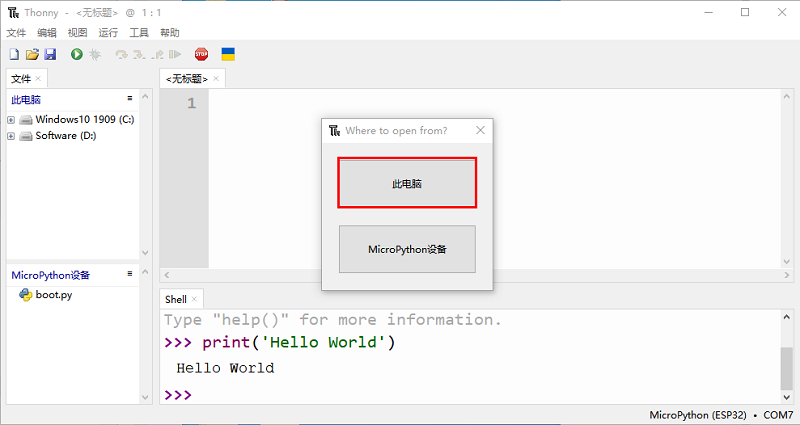

在新的对话框中，找到前面下载的代码，在路径为：“..\Python\Python代码、固件\Python_代码\项目01 Hello World” 中选择 “**Project_01_HelloWorld.py**” 。

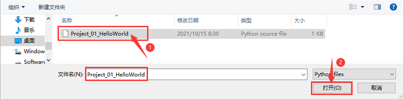

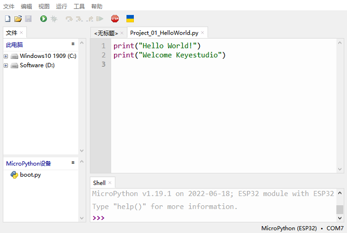

单击 , “**Hello World**” 将在 “**Shell**” 窗口中打印出来。

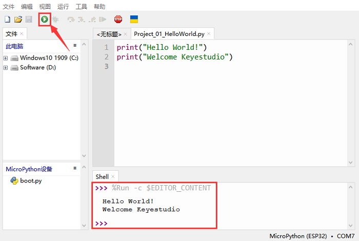

注意：在线运行时，如果按下ESP32的复位键，用户的代码将不会再次执行。

### **5. Thonny常见的操作**

本教程中使用的代码保存在（即路径）：“**..\Python\Python代码、固件\Python_代码**”。

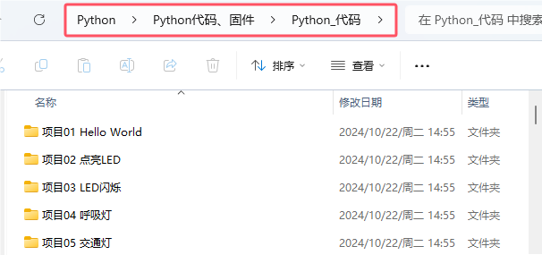

你可以把代码移到任何地方。例如，我们将代码保存在 **D盘** 中，路径为D:\2. 项目教程。

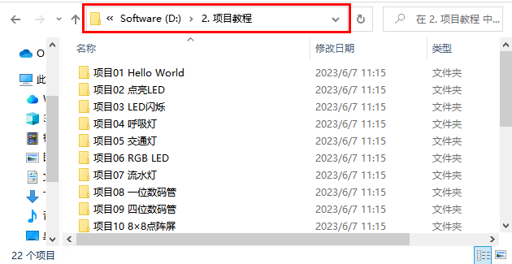

**上传代码到ESP32：**

为了方便起见，我们以 “**项目10 8×8点阵屏**” 为例。在 “**项目10 8×8点阵屏**” 文件夹中选择 “**ht16k33\.py**”，右键单击鼠标，选择 “**上传到/**” 将代码上传到ESP32的根目录中。

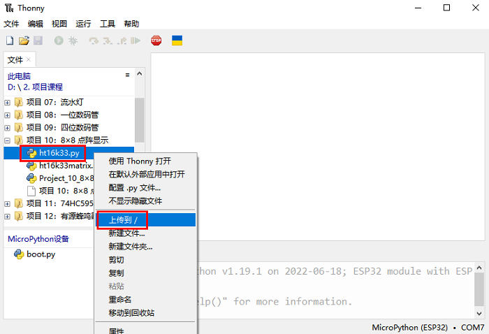

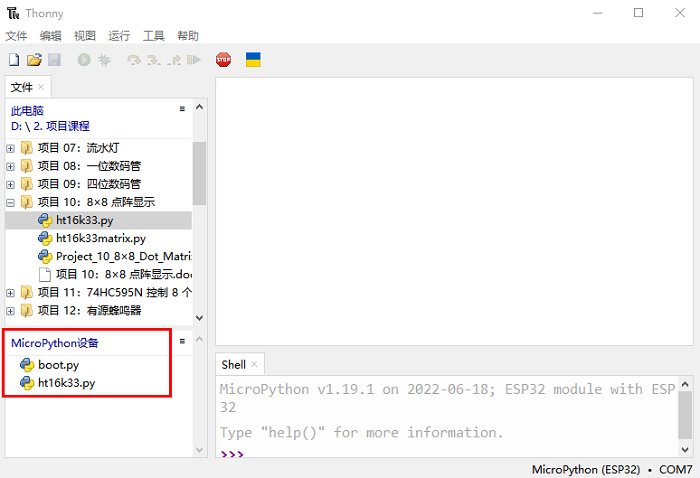

**下载代码到电脑：**

在 “**MicroPython 设备**” 中选择 “**boot\.py**”，右键选择 “**下载到…**” 把代码下载到你的电脑里。

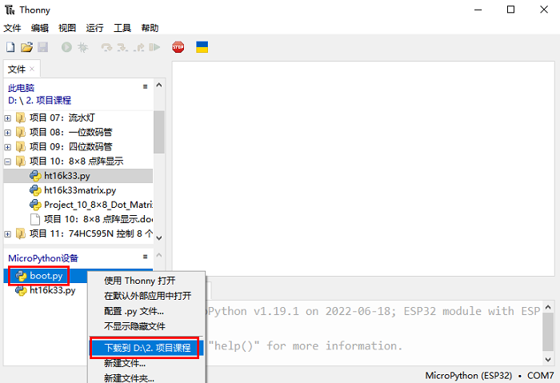

**删除ESP32根目录下的文件：**

在 “**MicroPython 设备**” 中选择 “**ht16k33\.py**”，右键单击它且选择 “**删除**”，将 “**ht16k33\.py**” 从ESP32的根目录中删除。

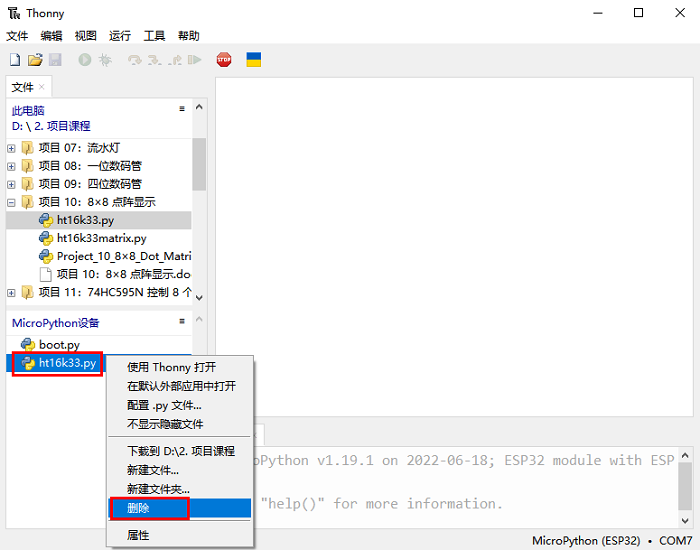

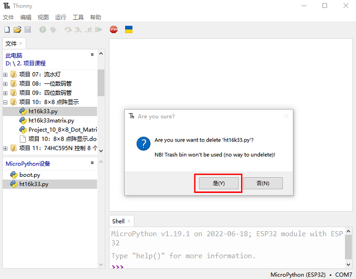

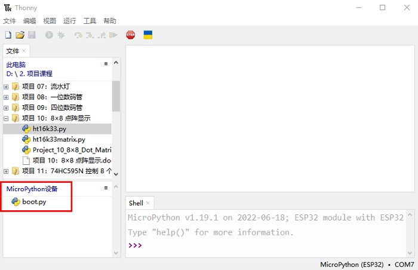

