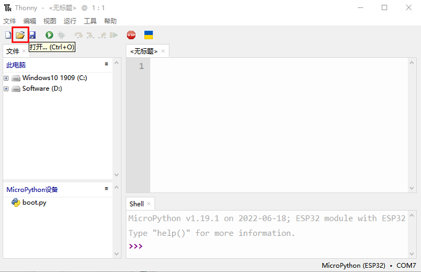
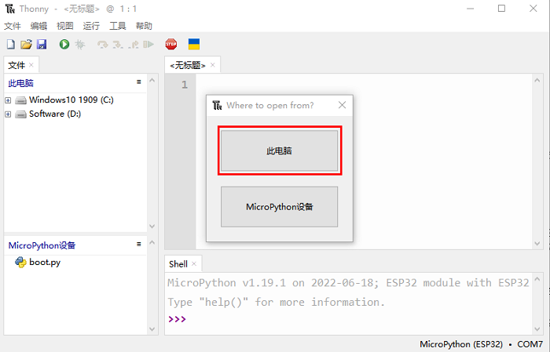
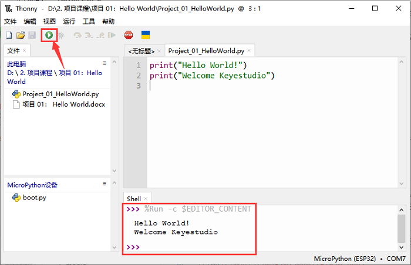
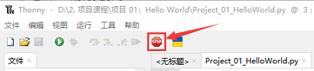

## 项目01 Hello World

**1. 项目介绍：**

对于ESP32的初学者，我们将从一些简单的东西开始。在这个项目中，你只需要一个ESP32主板，USB线和电脑就可以完成“Hello World!”项目。它不仅是ESP32主板和电脑的通信测试，也是ESP32的初级项目。

**2. 项目元件：**

|||
| :--: | :--: |
| ESP32*1 | USB 线*1 |

**3. 项目接线：**

在本项目中，我们通过USB线将ESP32和电脑连接起来。

**4. 在线运行代码：**

要在线运行ESP32，你需要把ESP32连接到电脑上。这样就可以使用Thonny软件编译或调试程序。

**优点：** 

1\. 你们可以使用Thonny软件编译或调试程序。

2\. 通过“Shell”窗口，你们可以查看程序运行过程中产生的错误信息和输出结果，并可以在线查询相关功能信息，帮助改进程序。

**缺点：**

1\. 要在线运行ESP32，你必须将ESP32连接到一台电脑上并和Thonny软件一起运行。

2\. 如果ESP32与电脑断开连接，当它们重新连接时，程序将无法再次运行。

**基本操作：**

1\. 打开Thonny软件，并且单击  “**打开...**”。

2\. 在新弹出的窗口中，单击 “**此电脑**”。

3\. 在新的对话框中，选中 “**Project_01_HelloWorld.py**”，单击 “**打开**”。

**注意：**

代码可以从前面 “**资料下载**” 中找到。

4\. 单击  来执行程序 “Hello World!”, "Welcome Keyestudio" 并将打印在 “**Shell**” 窗口。

5\. 退出在线运行

当在线运行时，单击Thonny软件上  或按 Ctrl+C 退出程序。

