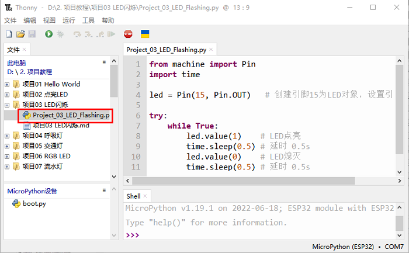

## 项目03 LED闪烁

**1. 项目介绍：**

在这个项目中，我们将向你展示LED闪烁效果。我们使用ESP32的数字引脚打开LED，让它闪烁。

**2. 项目元件：**

||||
| :--: | :--: | :--: |
|ESP32*1|面包板*1|红色LED*1|
|| ||
|220Ω电阻*1|跳线*2|USB 线*1|

**3. 项目接线图：**

首先，切断ESP32的所有电源。然后根据电路图和接线图搭建电路。电路搭建好并验证无误后，用USB线将ESP32连接到电脑上。

<span style="color: rgb(255, 76, 65);">注意：</span>避免任何可能的短路(特别是连接3.3V和GND)!

<span style="color: rgb(255, 76, 65);">警告：短路可能导致电路中产生大电流，造成元件过热，并对硬件造成永久性损坏。 </span>


<span style="color: rgb(255, 76, 65);">注意: </span>

怎样连接LED 


怎样识别五色环220Ω电阻


**4. 项目代码：**

代码可以从前面 “**资料下载**” 中找到。（注意：从本课程开始后续课程不再进行此提示）


你可以把代码移到任何地方。例如，我们将代码保存在 **D盘** 中，<span style="color: rgb(0, 209, 0);">路径为D:\2. 项目教程</span>。


打开 “**Thonny**” 软件，点击 “**此电脑**” → “**D:**” → “**2. 项目教程**” → “**项目03 LED闪烁**”。并鼠标左键双击 “**Project_03_LED_Flashing.py**”。



```python
from machine import Pin
import time

led = Pin(15, Pin.OUT)   # 创建引脚15为LED对象，设置引脚15为输出

try:
    while True:
        led.value(1)    # LED点亮
        time.sleep(0.5) # 延时 0.5s
        led.value(0)    # LED熄灭
        time.sleep(0.5) # 延时 0.5s
except:
    pass

```
**5. 项目现象：**

确保ESP32已经连接到电脑上，单击 。


单击  ，代码开始执行，你会看到的现象是：电路中的LED开始闪烁。按 “Ctrl+C” 或单击  退出程序。


