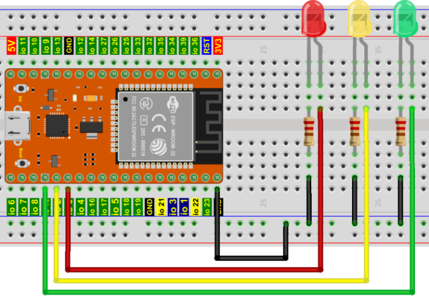
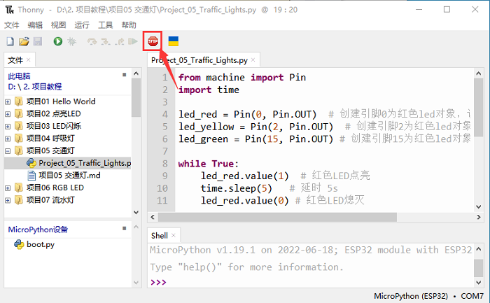
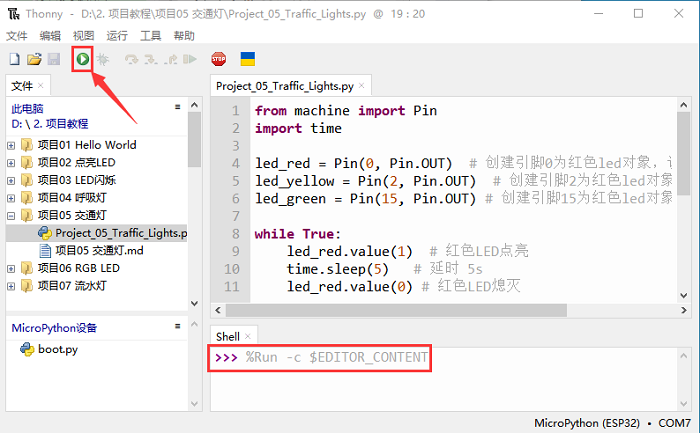

## 项目05 交通灯

**1. 项目介绍：**

交通灯在我们的日常生活中很普遍。根据一定的时间规律，交通灯是由红、黄、绿三种颜色组成的。每个人都应该遵守交通规则，这可以避免许多交通事故。

在这个项目中，我们将使用ESP32和一些led(红，黄，绿)来模拟交通灯。

**2. 项目元件：**

|||||
| :--: | :--: | :--: | :--: |
|ESP32*1|面包板*1|红色LED*1|黄色 LED*1|
||| ||
|绿色LED*1|220Ω电阻*3|跳线若干|USB 线*1|

**3. 项目接线图：**



**4. 项目代码：**


你可以把代码移到任何地方。例如，我们将代码保存在 **D盘** 中，<span style="color: rgb(0, 209, 0);">路径为D:\2. 项目教程</span>。


打开 “Thonny” 软件，点击 “此电脑” → “D:” → “2. 项目教程” → “项目05 交通灯”。并鼠标左键双击 “Project_05_Traffic_Lights.py”。


```python
from machine import Pin
import time

led_red = Pin(0, Pin.OUT)  # 创建引脚0为红色led对象，设置引脚0为输出
led_yellow = Pin(2, Pin.OUT)  # 创建引脚2为黄色led对象，设置引脚2为输出
led_green = Pin(15, Pin.OUT) # 创建引脚15为绿色led对象，设置引脚15为输出

while True:
    led_red.value(1)  # 红色LED点亮
    time.sleep(5)   # 延时 5s
    led_red.value(0) # 红色LED熄灭
    led_yellow.value(1)
    time.sleep(0.5)
    led_yellow.value(0)
    time.sleep(0.5)
    led_yellow.value(1)
    time.sleep(0.5)
    led_yellow.value(0)
    time.sleep(0.5)
    led_yellow.value(1)
    time.sleep(0.5)
    led_yellow.value(0)
    time.sleep(0.5)
    led_green.value(1)
    time.sleep(5) 
    led_green.value(0) 
```
**5. 项目现象：**

确保ESP32已经连接到电脑上，单击 。



单击 ，代码开始执行，你会看到的现象是：1.首先，红灯会亮5秒，然后熄灭；2.其次，黄灯会闪烁3次，然后熄灭；3.然后，绿灯会亮5秒，然后熄灭；4.继续运行上述1-3个步骤。按 “Ctrl+C” 或单击  退出程序。




