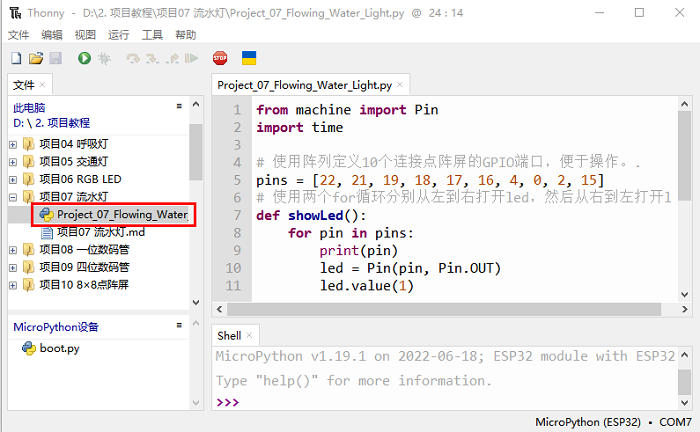
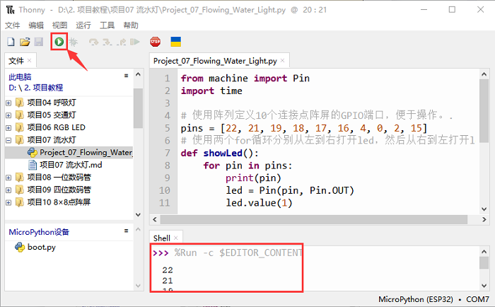

## 项目07 流水灯

**1. 项目介绍：**

在日常生活中，我们可以看到许多由不同颜色的led组成的广告牌。他们不断地改变灯光(像流水一样)来吸引顾客的注意。

在这个项目中，我们将使用ESP32控制10个leds实现流水的效果。 

**2. 项目元件：**

||||
| :--: | :--: | :--: |
|ESP32*1|面包板*1|红色LED*10|
|| ||
|220Ω电阻*10|跳线若干|USB 线*1|

**3. 项目接线图:**


**4. 项目代码：**

本项目是设计制作一个流水灯。这是这些行动：首先打开LED 1，然后关闭它。然后打开LED 2，然后关闭…并对所有10个LED重复同样的操作，直到最后一个LED关闭。这一过程反复进行，以实现流水的“运动”。


你可以把代码移到任何地方。例如，我们将代码保存在 **D盘** 中，<span style="color: rgb(0, 209, 0);">路径为D:\2. 项目教程</span>。


打开 “Thonny” 软件，点击 “此电脑” → “D:” → “2. 项目教程” → “项目07 流水灯”。并鼠标左键双击 “Project_07_Flowing_Water_Light.py”。



```python
from machine import Pin
import time

# 使用阵列定义10个连接点阵屏的GPIO端口，便于操作。.
pins = [22, 21, 19, 18, 17, 16, 4, 0, 2, 15]
# 使用两个for循环分别从左到右打开led，然后从右到左打开led
def showLed():
    for pin in pins:
        print(pin)
        led = Pin(pin, Pin.OUT)
        led.value(1)
        time.sleep_ms(100)
        led.value(0)
        time.sleep_ms(100)        
    for pin in reversed(pins):
        print(pin)
        led = Pin(pin, Pin.OUT)
        led.value(1)
        time.sleep_ms(100)
        led.value(0)
        time.sleep_ms(100)
          
while True:
    showLed()
```
**5. 项目现象：**

确保ESP32已经连接到电脑上，单击 。


单击 ，代码开始执行，你会看到的现象是：10个LED将从左到右点亮，然后从右到左返回。按 “Ctrl+C” 或单击  退出程序。




