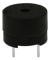
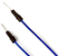
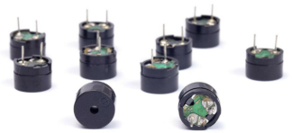
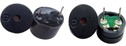
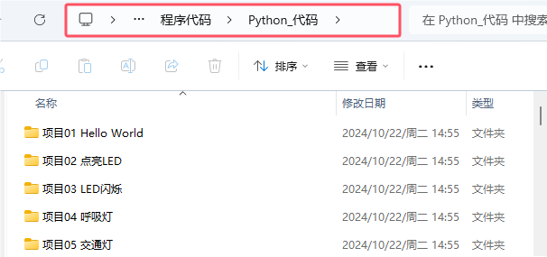
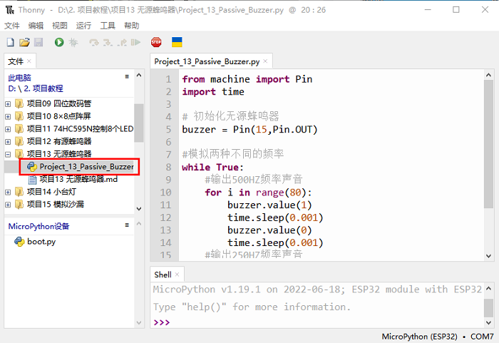
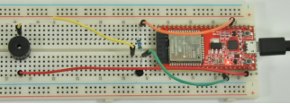

## 项目13 无源蜂鸣器

**1. 项目介绍:** 

在之前的项目中，我们研究了有源蜂鸣器，它只能发出一种声音，可能会让你觉得很单调。这个项目将学习另一种蜂鸣器，无源蜂鸣器。与有源蜂鸣器不同，无源蜂鸣器可以发出不同频率的声音。

在这个项目中，你将使用ESP32控制无源蜂鸣器工作。

**2. 项目元件：**

|||||
| :--: | :--: | :--: | :--: |
|ESP32*1|面包板*1|无源蜂鸣器*1|NPN型晶体管(S8050)*1|
|| || |
|1KΩ电阻*1|跳线若干|USB线*1| |

**3. 元件知识：**

   

**无源蜂鸣器：** 它是一种内部没有振动源的集成电子蜂鸣器。它必须由2K-5K方波驱动，而不是直流信号。与有源蜂鸣器的外观非常相似，但是一个带有绿色电路板的蜂鸣器是无源蜂鸣器，而另一个带有黑色胶带的是有源蜂鸣器。无源蜂鸣器不能区分正极性而有源蜂鸣器是可以。



**晶体管:** 请参考**项目12** 。

**4. 项目接线图:**


**5. 项目代码：**



你可以把代码移到任何地方。例如，我们将代码保存在 **D盘** 中，<span style="color: rgb(0, 209, 0);">路径为D:\2. 项目教程</span>。


打开 “Thonny” 软件，点击 “此电脑” → “D:” → “2. 项目教程” → “项目13 无源蜂鸣器”。并鼠标左键双击 “Project_13_Passive_Buzzer.py”。



```python
from machine import Pin
import time

# 初始化无源蜂鸣器
buzzer = Pin(15,Pin.OUT)

#模拟两种不同的频率
while True:
    #输出500HZ频率声音
    for i in range(80):
        buzzer.value(1)
        time.sleep(0.001)
        buzzer.value(0)
        time.sleep(0.001)
    #输出250HZ频率声音
    for i in range(100):
        buzzer.value(1)
        time.sleep(0.002)
        buzzer.value(0)
        time.sleep(0.002)
```
**6. 项目现象：**

确保ESP32已经连接到电脑上，单击 。


单击 ，代码开始执行，你会看到的现象是：无源蜂鸣器发出警报声。按 “Ctrl+C” 或单击  退出程序。





