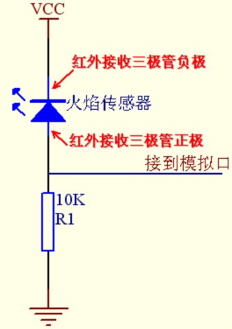
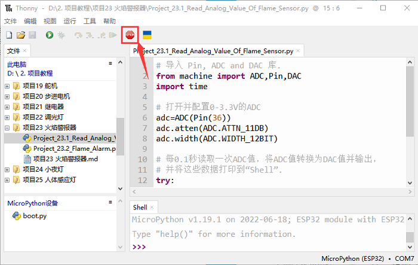
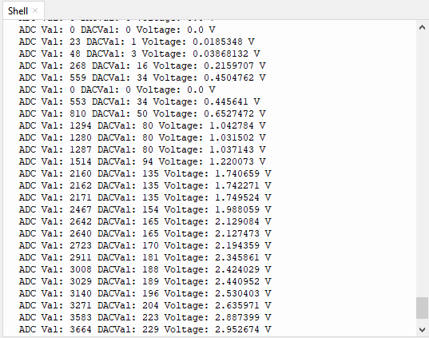
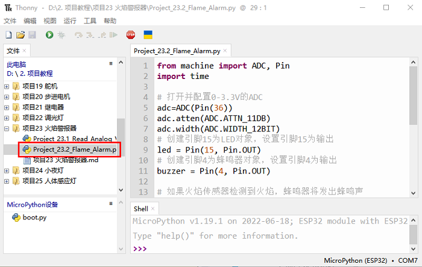
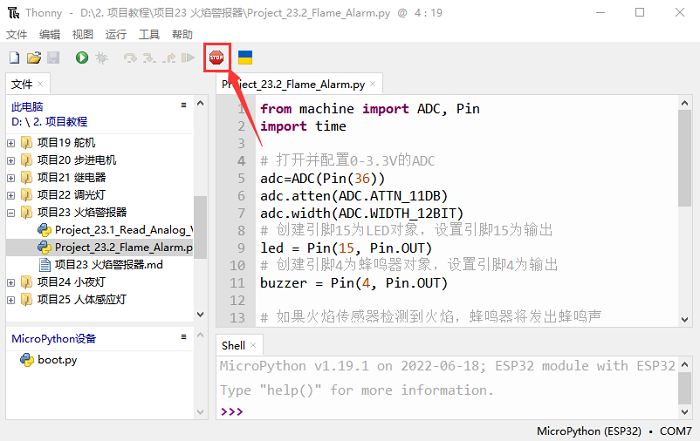

## 项目23 火焰警报器

**1. 项目介绍：**

火灾是一种可怕的灾害，火灾报警系统在房屋，商业建筑和工厂中是非常有用的。

在本项目中，我们将使用ESP32控制火焰传感器，蜂鸣器和LED来模拟火灾报警装置。这是一个有意义的创客活动。

**2. 项目元件：**

|||||
| :--: | :--: | :--: | :--: |
|ESP32*1|面包板*1|火焰传感器*1|红色 LED*1|
|||| |
|有源蜂鸣器*1|220Ω电阻*1|10KΩ电阻*1|跳线若干 |
|||| |
|NPN型晶体管(S8050)*1|1kΩ 电阻*1 |USB 线*1| |

**3. 元件知识：**


**火焰传感器（红外接收三极管）：** 火焰会发出一定程度的IR光，这种光人眼是看不到的，但我们的红外接收三极管可以检测到它，并提醒微控制器（如ESP32）已经检测到火灾。红外接收三极管可以探测火焰，然后将火焰亮度转换为波动水平信号。红外接收三极管的短引脚是负极，另一个长引脚是正极。我们应该连接短引脚（负极)到5V，连接长引脚(正极)到模拟引脚，一个电阻和GND。如下图所示：



<span style="color: rgb(255, 76, 65);">注意：</span>火焰传感器应避开日光、汽车头灯、白炽灯直接照射，也不能对着热源(如暖气片、加热器)或空调，以避免环境温度较大的变化而造成误报。同时还易受射频辐射的干扰。

**4. 读取火焰传感器的ADC值，DAC值和电压值：**

我们首先用一个简单的代码来读取火焰传感器的ADC值，DAC值和电压值并打印出来。接线请参照以下接线图：


你可以把代码移到任何地方。例如，我们将代码保存在 **D盘** 中，<span style="color: rgb(0, 209, 0);">路径为D:\2. 项目教程</span>。


打开 “Thonny” 软件，点击 “此电脑” → “D:” → “2. 项目教程” → “项目23 火焰警报器”。并鼠标左键双击 “Project_23.1_Read_Analog_Value_Of_Flame_Sensor.py”。


```python
# 导入 Pin, ADC and DAC 库.
from machine import ADC,Pin,DAC
import time

# 打开并配置0-3.3V的ADC 
adc=ADC(Pin(36))
adc.atten(ADC.ATTN_11DB)
adc.width(ADC.WIDTH_12BIT)

# 每0.1秒读取一次ADC值，将ADC值转换为DAC值并输出，
# 并将这些数据打印到“Shell”. 
try:
    while True:
        adcVal=adc.read()
        dacVal=adcVal//16
        voltage = adcVal / 4095.0 * 3.3
        print("ADC Val:",adcVal,"DACVal:",dacVal,"Voltage:",voltage,"V")
        time.sleep(0.1)
except:
    pass
```
确保ESP32已经连接到电脑上，单击 。



单击 ，代码开始执行，你会看到的现象是：Thonny IDE下的 “**Shell**” 窗口将打印火焰传感器读取的ADC值，DAC值和电压值，当火焰靠近火焰传感器时，ADC值，DAC值和电压值增大；反之，ADC值，DAC值和电压值减小。按 “Ctrl+C” 或单击  退出程序。




**5. 火焰报警的接线图：**

接下来，我们将使用火焰传感器和蜂鸣器、LED制作一个有趣的项目——火灾报警装置。当火焰传感器检测到火焰时，LED闪烁，蜂鸣器报警。


**6. 项目代码：**

（<span style="color: rgb(255, 76, 65);">注意：代码中的阀值500可以根据实际情况自己重新设置</span>）


你可以把代码移到任何地方。例如，我们将代码保存在 **D盘** 中，<span style="color: rgb(0, 209, 0);">路径为D:\2. 项目教程</span>。


打开 “Thonny” 软件，点击 “此电脑” → “D:” → “2. 项目教程” → “项目23 火焰警报器”。并鼠标左键双击 “Project_23.2_Flame_Alarm.py”。



```python
from machine import ADC, Pin
import time

# 打开并配置0-3.3V的ADC 
adc=ADC(Pin(36))
adc.atten(ADC.ATTN_11DB)
adc.width(ADC.WIDTH_12BIT)
# 创建引脚15为LED对象，设置引脚15为输出
led = Pin(15, Pin.OUT) 
# 创建引脚4为蜂鸣器对象，设置引脚4为输出
buzzer = Pin(4, Pin.OUT)   
 
# 如果火焰传感器检测到火焰，蜂鸣器将发出蜂鸣声
#，当模拟值大于500时，LED闪烁
# 否则，蜂鸣器不响，LED熄灭

while True:
    adcVal=adc.read()
    if adcVal >500:
        buzzer.value(1) # 蜂鸣器鸣叫
        led.value(1)    # LED点亮
        time.sleep(0.5) # 延时 0.5s
        buzzer.value(0) # 蜂鸣器关闭
        led.value(0)    
        time.sleep(0.5) # 延时 0.5s
    else:
        buzzer.value(0) # 蜂鸣器关闭
        led.value(0)    # LED熄灭

```
**7. 项目现象：**

确保ESP32已经连接到电脑上，单击 。



单击 ，代码开始执行，你会看到的现象是：当火焰传感器检测到火焰时，LED闪烁，蜂鸣器报警；否则，LED不亮，蜂鸣器不响。按 “Ctrl+C” 或单击  退出程序。


