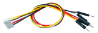
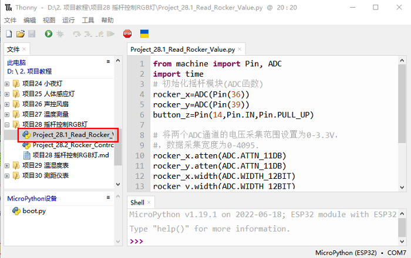
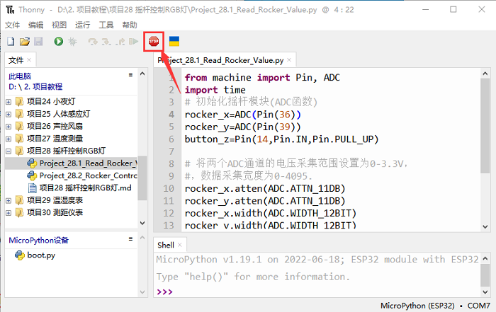
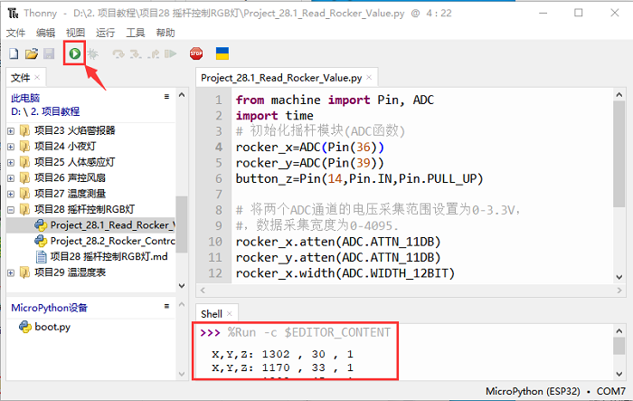
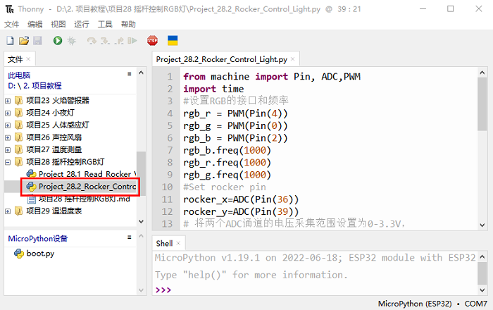
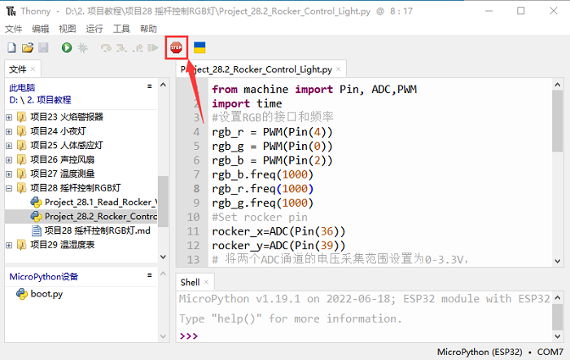
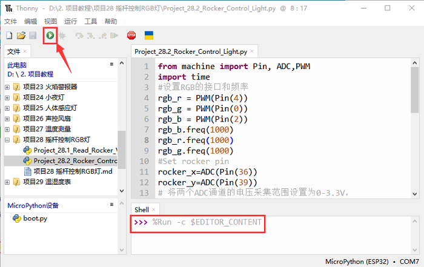

## 项目28 摇杆控制RGB灯

**1. 项目介绍：**

摇杆模块是一个有两个模拟输入和一个数字输入的组件。广泛应用于游戏操作、机器人控制、无人机控制等领域。

在这个项目中，我们使用ESP32和摇杆模块控制RGB。这样，你可以在实践中对摇杆模块的原理和操作有更深入的了解。 

**2. 项目元件：**

|||||
| :--: | :--: | :--: | :--: |
|ESP32*1|面包板*1|摇杆模块*1|RGB LED*1|
|| |||
|220Ω电阻*3|跳线若干|USB 线*1|5P转杜邦线公单*1|

**3. 元件知识：**


**摇杆模块：** 主要是采用PS2手柄摇杆元件，实际上摇杆模块有3个信号端引脚，模拟3维空间，摇杆模块的引脚分别是GND、VCC、信号端（B、X、Y），其中信号端X、Y模拟空间的X轴和Y轴，控制时，模块的X、Y信号端是连接控制板模拟口，通过控制2个模拟输入值来控制物体在空间X、Y轴的坐标。信号端B模拟空间Z轴，它一般是接数字口，做按键使用。

VCC接控制板的电源输出端V/VCC（3.3/5V），GND接控制板的G/GND，原始状态下读出电压大约为1.65V/2.5V左右，对于X轴方向，当随箭头方向逐渐移动，读出电压值随着增加，且可以达到最大电压；随箭头相反方向逐渐移动，读出电压值逐渐减少，减少到最小电压。对于Y轴方向，当沿着模块上的箭头方向逐渐按下，读出电压值随着增加，且可以达到最大电压；随箭头相反方向逐渐按下，读出电压值逐渐减少，减少到最小电压。对于Z轴方向，信号端B接数字口，原始状态下输出0，按下输出1。这样，我们可以读取两个模拟值和一个数字口的高低电平情况，来判断模块上摇杆的工作状态。

**模块参数：**

- 输入电压：DC 3.3V ~ 5V
- 输出信号：X/Y双轴模拟值+Z轴数字信号
- 适用范围：适用于控制点坐标在平面内的运动，双自由度舵机的控制等。
- 产品特点：外观精美，摇杆手感优越，操作简单，反应灵敏，使用寿命长。

**4. 读取摇杆模块的值：**

我们必须使用ESP32的模拟IO口从摇杆模块的X/Y引脚读取值，并使用数字IO口读取按钮的数字信号。请按照下面的接线图进行接线：


你可以把代码移到任何地方。例如，我们将代码保存在 **D盘** 中，<span style="color: rgb(0, 209, 0);">路径为D:\2. 项目教程</span>。


打开 “Thonny” 软件，点击 “此电脑” → “D:” → “2. 项目教程” → “项目28 摇杆控制RGB灯”。并鼠标左键双击 “Project_28.1_Read_Rocker_Value.py”。



```python
from machine import Pin, ADC
import time
# 初始化摇杆模块(ADC函数)
rocker_x=ADC(Pin(36))
rocker_y=ADC(Pin(39))
button_z=Pin(14,Pin.IN,Pin.PULL_UP)

# 将两个ADC通道的电压采集范围设置为0-3.3V，
#，数据采集宽度为0-4095.
rocker_x.atten(ADC.ATTN_11DB)
rocker_y.atten(ADC.ATTN_11DB)
rocker_x.width(ADC.WIDTH_12BIT)
rocker_y.width(ADC.WIDTH_12BIT)
 
# 在代码中，将Z_Pin配置为上拉输入模式。
# 在loop()中，使用Read()读取X轴和Y轴的值
# 和使用value()来读取Z轴的值，然后显示它们.
while True:
    print("X,Y,Z:",rocker_x.read(),",",rocker_y.read(),",",button_z.value())
    time.sleep(0.5)
    
```
确保ESP32已经连接到电脑上，单击 。



单击 ，代码开始执行，你会看到的现象是：Thonny IDE下的 “**Shell**” 窗口将打印当前摇杆的模拟值和数字值，移动摇杆或按下摇杆帽将改变 “Shell” 中的模拟值和数字值。按 “Ctrl+C” 或单击  退出程序。




**5. 摇杆模块控制RGB的接线图:**

我们刚读了摇杆模块的值，这里我们需要用摇杆模块和RGB做一些事情，按照下图连接：


**6. 项目代码：**


你可以把代码移到任何地方。例如，我们将代码保存在 **D盘** 中，<span style="color: rgb(0, 209, 0);">路径为D:\2. 项目教程</span>。


打开 “Thonny” 软件，点击 “此电脑” → “D:” → “2. 项目教程” → “项目28 摇杆控制RGB灯”。并鼠标左键双击 “Project_28.2_Rocker_Control_Light.py”。



```python
from machine import Pin, ADC,PWM 
import time
#设置RGB的接口和频率
rgb_r = PWM(Pin(4))
rgb_g = PWM(Pin(0))
rgb_b = PWM(Pin(2))
rgb_b.freq(1000)
rgb_r.freq(1000)
rgb_g.freq(1000)
#Set rocker pin
rocker_x=ADC(Pin(36))
rocker_y=ADC(Pin(39))
# 将两个ADC通道的电压采集范围设置为0-3.3V，
# 数据采集宽度为0-4095.
rocker_x.atten(ADC.ATTN_11DB)
rocker_y.atten(ADC.ATTN_11DB)
rocker_x.width(ADC.WIDTH_12BIT)
rocker_y.width(ADC.WIDTH_12BIT)

while True:
    y = rocker_y.read()#得到摇杆模块的Y值
    x = rocker_x.read()#得到摇杆模块的X值
    if x < 1000:    #左
        rgb_b.duty(0)
        rgb_r.duty(1023)
        rgb_g.duty(0)
    elif x > 3000:    #右
        rgb_b.duty(0)
        rgb_r.duty(0)
        rgb_g.duty(1023)
    elif y < 1000:    #下
        rgb_b.duty(1023)
        rgb_r.duty(0)
        rgb_g.duty(0)
    elif y > 3000:    #上
        rgb_b.duty(1023)
        rgb_r.duty(1023)
        rgb_g.duty(1023)
    time.sleep(0.01)
```
**7. 项目现象：**

确保ESP32已经连接到电脑上，单击 。



单击 ，代码开始执行，你会看到的现象是：①如果摇杆在X方向上移动到最左边，RGB光变成红色; ②如果摇杆在X方向上移动到最右边，RGB光变为绿色; ③如果摇杆在Y方向上移动到最上面，RGB光变成白色; ④如果摇杆在Y方向上移动到最下面，RGB光变成蓝色。按 “Ctrl+C” 或单击 退出程序。




