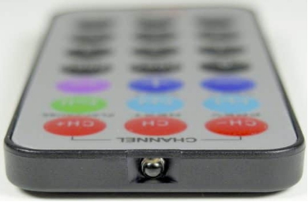
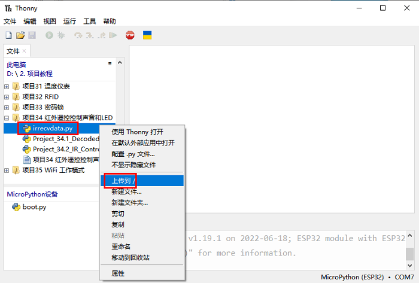
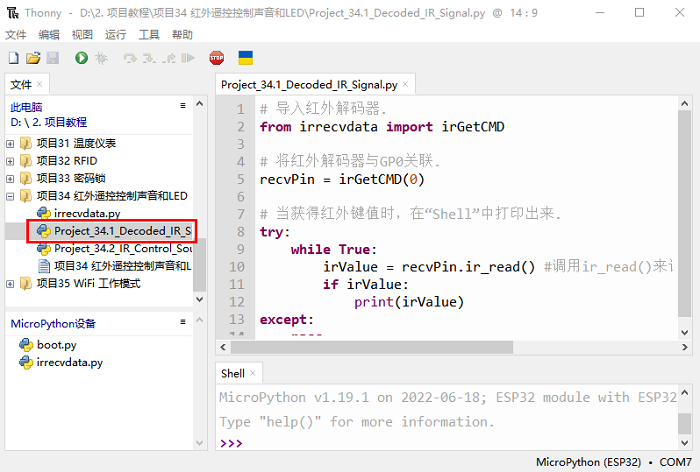
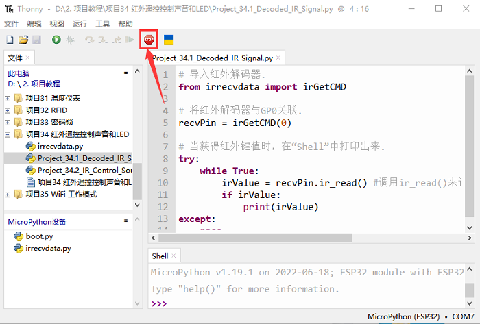
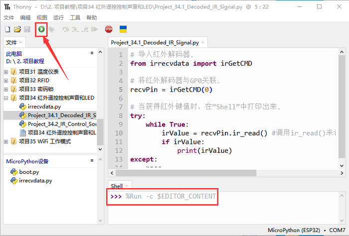
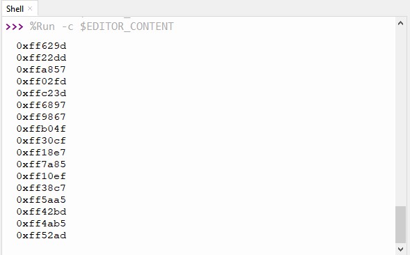
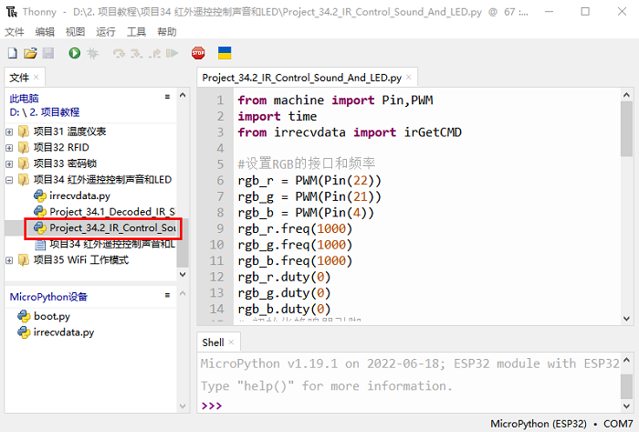
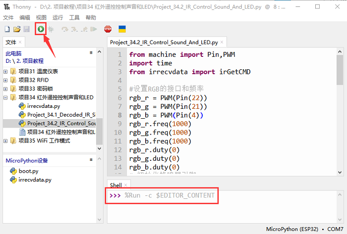

## 项目34 红外遥控控制声音和LED

**1. 项目介绍：**

红外遥控是一种低成本、易于使用的无线通信技术。IR光与可见光非常相似，除了它的波长稍长一点。这意味着红外线是人眼无法检测到的，这对于无线通信来说是完美的。例如，当你按下电视遥控器上的一个按钮时，一个红外LED会以每秒38000次的频率反复开关，将信息(如音量或频道控制)传送到电视上的红外感光器。

我们将首先解释常见的红外通信协议是如何工作的。然后我们将从一个遥控器和一个红外接收组件开始这个项目。

**2. 项目元件：**

|||||
| :--: | :--: | :--: | :--: |
|ESP32*1|面包板*1|红外接收器*1|RGB LED*1|
|||| |
|有源蜂鸣器*1|220Ω电阻*3|10KΩ电阻*1|红外遥控器*1|
|||| |
|NPN型晶体管(S8050)*1|1kΩ电阻*1 |USB 线*1| 跳线若干|

**3. 元件知识：**

**红外(IR)遥控器：** 是一种可以发射红外光信号的设备。按下不同的按钮，位于遥控器前端的红外发射管会发出不同指令的红外线。红外遥控技术应用广泛，如电视、空调等。因此，在当今科技发达社会，红外遥控技术使你切换电视节目和调节空调温度都很方便。

我们使用的遥控器如下所示：



该红外遥控器采用NEC编码。

**红外(IR)接收器：** 它是一种元件，可以接收红外光，所以可以用它来接收红外遥控器发出的红外光信号。红外接收器解调接收到的红外光信号，并将其转换回二进制，然后将信息传递给微控制器。

红外信号调制过程图：


**4. 解码红外信号：**

我们按照下面接线图将红外接收元件连接到ESP32。


你可以把代码移到任何地方。例如，我们将代码保存在 **D盘** 中，<span style="color: rgb(0, 209, 0);">路径为D:\2. 项目教程</span>。


打开 “Thonny” 软件，点击 “此电脑” → “D:” → “2. 项目教程” → “项目34 红外遥控控制声音和LED”。选择 “irrecvdata\.py”，右键单击选择 “**上传到/**”,等待 “irrecvdata\.py” 被上传到ESP32. 并鼠标左键双击 “Project_34.1_Decoded_IR_Signal.py”。





```python
# 导入红外解码器.
from irrecvdata import irGetCMD

# 将红外解码器与GP0关联.
recvPin = irGetCMD(0)

# 当获得红外键值时，在“Shell”中打印出来. 
try:
    while True:
        irValue = recvPin.ir_read() #调用ir_read()来读取所按键的值并将其赋值给IRValue.
        if irValue:
            print(irValue)
except:
    pass

```
确保ESP32已经连接到电脑上，单击 。



单击 ，代码开始执行，你会看到的现象是：将红外遥控器发射器对准红外接收头，按下红外控制器上的按键，Thonny IDE下的 “**Shell**” 窗口将打印当前接收到的按键编码值。按 “Ctrl+C” 或单击  退出程序。





写下红外遥控器与每个按键相关联的按键编码值，因为你稍后将需要这些信息。


**5. 红外遥控的接线图：**


**6. 项目代码：**


你可以把代码移到任何地方。例如，我们将代码保存在 **D盘** 中，<span style="color: rgb(0, 209, 0);">路径为D:\2. 项目教程</span>。


打开 “Thonny” 软件，点击 “此电脑” → “D:” → “2. 项目教程” → “项目34 红外遥控控制声音和LED”。选择 “irrecvdata\.py”，右键单击选择 “**上传到/**”,等待 “irrecvdata\.py” 被上传到ESP32. 并鼠标左键双击 “Project_34.2_IR_Control_Sound_And_LED.py”。




```python
from machine import Pin,PWM
import time
from irrecvdata import irGetCMD

#设置RGB的接口和频率
rgb_r = PWM(Pin(22))
rgb_g = PWM(Pin(21))
rgb_b = PWM(Pin(4))
rgb_r.freq(1000)
rgb_g.freq(1000)
rgb_b.freq(1000)
rgb_r.duty(0)
rgb_g.duty(0)
rgb_b.duty(0)
# 初始化蜂鸣器引脚 
buzzer=Pin(15, Pin.OUT)

#配置红外接收引脚和库
recvPin = irGetCMD(0)

while True:
    irValue = recvPin.ir_read() # 读取远程控制数据
 # 确定是否有满足需求的按钮 
    if irValue:
        print(irValue)
        buzzer.value(1)
        time.sleep(0.1)
        buzzer.value(0)
        if irValue == '0xff6897':   #1
           rgb_r.duty(1023)
           rgb_g.duty(0)
           rgb_b.duty(0)
           print('1')
        elif irValue == '0xff9867': #2
            rgb_r.duty(0)
            rgb_g.duty(1023)
            rgb_b.duty(0)
            print('2')
        elif irValue == '0xffb04f': #3
            rgb_r.duty(0)
            rgb_g.duty(0)
            rgb_b.duty(1023)
            print('3')
        elif irValue == '0xff30cf': #4
            rgb_r.duty(1023)
            rgb_g.duty(1023)
            rgb_b.duty(0)
            print('4')
        elif irValue == '0xff18e7': #5
            rgb_r.duty(1023)
            rgb_g.duty(0)
            rgb_b.duty(1023)
            print('5')
        elif irValue == '0xff7a85': #6
            rgb_r.duty(0)
            rgb_g.duty(1023)
            rgb_b.duty(1023)
            print('6')
        elif irValue == '0xff10ef': #7
            rgb_r.duty(1023)
            rgb_g.duty(1023)
            rgb_b.duty(1023)
            print('7') 
        else:
            rgb_r.duty(0)
            rgb_g.duty(0)
            rgb_b.duty(0)
```
**7. 项目现象：**

确保ESP32已经连接到电脑上，单击 。


单击 ，代码开始执行，你会看到的现象是：按红外遥控器的1~7键，蜂鸣器都会鸣响一次，同时RGB分别亮红灯，绿灯，蓝灯，黄灯，洋红灯，蓝绿灯，白灯。按其他另一按键（除1-7键以外），RGB熄灭。按 “Ctrl+C” 或单击  退出程序。



<span style="color: rgb(255, 76, 65);">特别注意：</span>当代码在运行时有时候会出现以下类似提示语，只要鼠标先单击 ，然后再单击  就可以使代码重新运行。


