## Arduino IDE 开发环境

**1.Windows系统：**

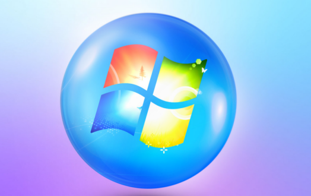

1.1. 下载安装Arduino软件：

(1)首先，进入Arduino官方网站：[https://www.arduino.cc/](https://www.arduino.cc/) ，点击“**SOFTWARE**”进入下载页面，如下图所示：

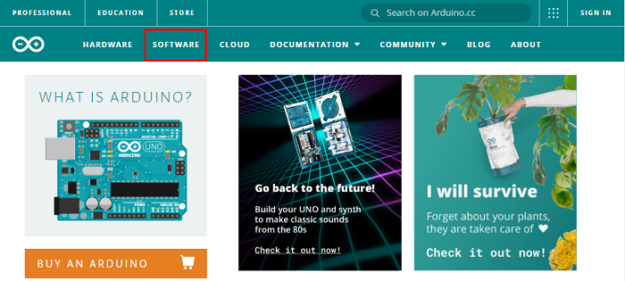 

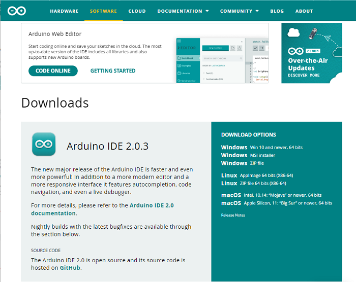

(2)然后，根据你的操作系统选择并下载相应的安装程序。如果你是Windows用户，请选择安装2.0.3版本Arduino IDE，当点击“**Windows** Win10 and newer,64bits”或“**Windows** MSI installer”，代表下载安装文件(.exe) ，需要手动安装; 当点击“**Windows** ZIP file”，代表直接下载2.0.3版本Arduino IDE，是一个压缩文件，解压就可以直接使用，无需安装。

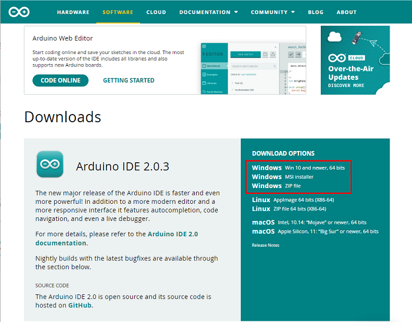

 点击下面图标，就可直接安装Arduino IDE了。

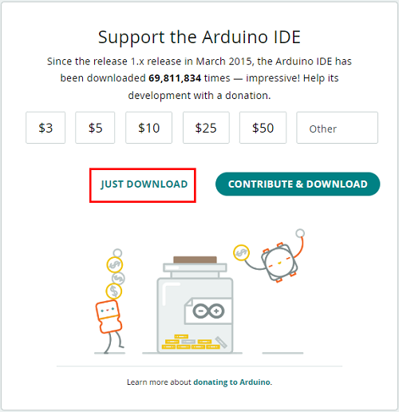

一般情况下，点击“**JUST DOWNLOAD**”就可以下载了，当然如果你愿意，你可以选择小小的赞助，以帮助伟大的Arduino开源事业。

(3)Arduino软件下载完成后,如果你是点击“**Windows** Win10 and newer,64bits”或“**Windows** MSI installer”下载的(.exe)文件“**arduino-ide_2.0.3_Windows_64bit.exe**” ，需要双击(.exe)文件继续安装，当你收到操作系统的警告时，请点击“**Allow access**”允许驱动程序安装。首先点击“**I Agree**”, 然后选择“Anyone who uses this computer(all users)”后再点击Next。

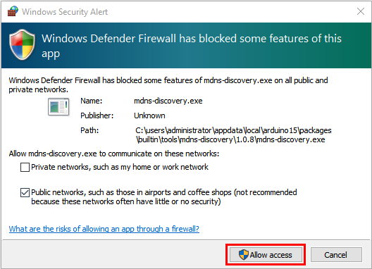

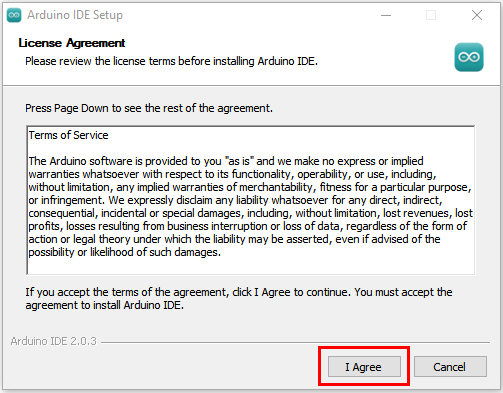

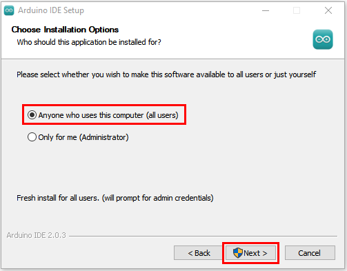

(4)点击“**Next**”后，如果又出现下面页面，点击“**I Agree**”。

(5)选择安装目录(我们建议保持默认目录)，然后点击“**Install**”。

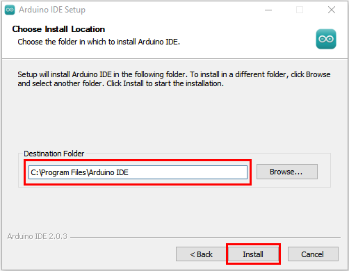

(6)如果出现以下界面，则应选择“**Install**”。

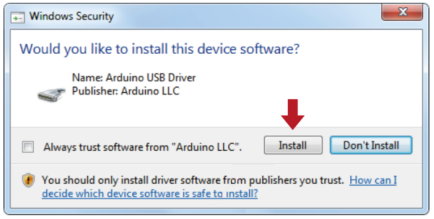

该过程将提取并安装所有必需的文件，以正确执行Arduino软件(IDE)。

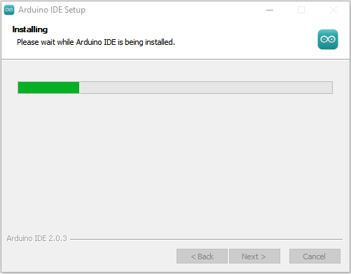

(7)安装完成后，会在桌面上生成一个Arduino IDE软件快捷方式。

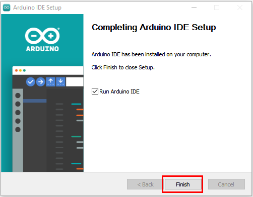

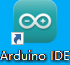

1.2. 在Windows系统上安装驱动：

（注意：如果电脑已经安装了驱动程序，则不需要再安装驱动；如果没有，则需要进行以下操作）
在使用ESP32主板之前，必须安装驱动程序，否则ESP32主板将无法与计算机通信。将主控板用USB线连接在电脑上，一般MacOS和Windows10系统的电脑会自动安装驱动。如果没能自动安装，则需要手动安装驱动。

（1）查看电脑是否自动安装好驱动：

点击“**计算机**”--“**属性**”--“**设备管理器**”，显示如下图是安装成功的了：

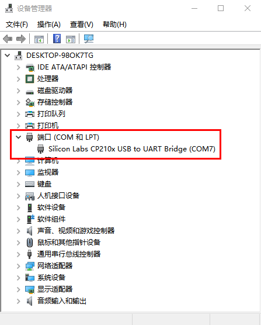

（2）如果没能自动安装，那就手动安装，步骤如下：

下载CP2102驱动程序的链接：[https://www.silabs.com/developers/usb-to-uart-bridge-vcp-drivers?tab=downloads](https://www.silabs.com/developers/usb-to-uart-bridge-vcp-drivers?tab=downloads)

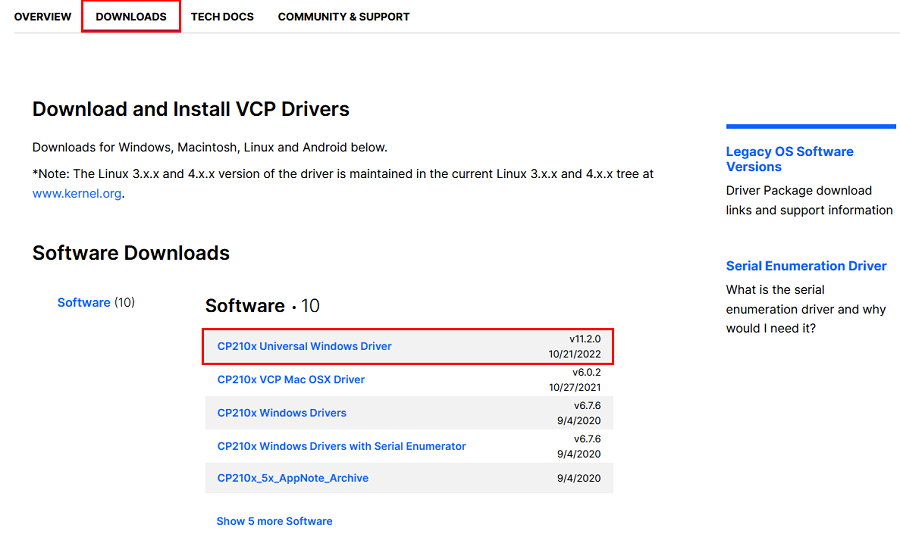

右键点击“**USB Serial**”，选择“**更新驱动程序(P)**”并点击。

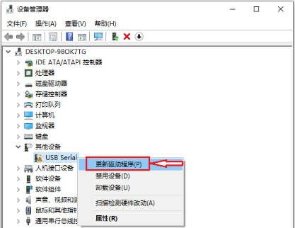

跳转到以下页面，选择“**浏览我的电脑以查找驱动程序(R)**”并点击。

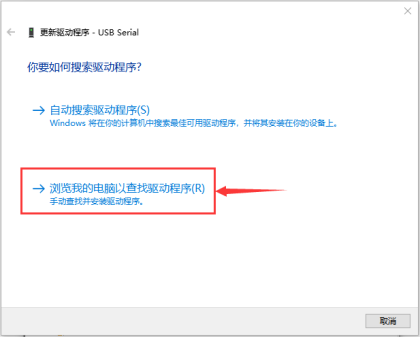

我们在对应的文件夹中也提供有CP210X系列芯片的驱动文件，位置如下：

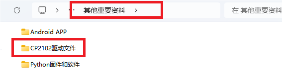

你可以先将驱动文件复制到电脑桌面上，然后点击“**浏览(R)...**”,选中CP210X系列芯片的驱动，最后点击“**下一页**”。

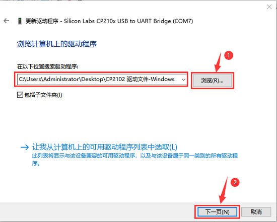

过一会儿，驱动安装成功。

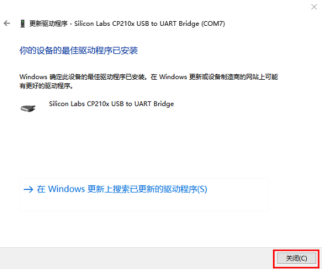

这个时候再打开计算机设备管理器，就可以看到CP2102驱动程序已经安装成功了，刚刚那个黄色的感叹号不见了。

1.3. Arduino IDE工具栏介绍：

点击电脑桌面上的图标，打开Arduino IDE。

 -- 用于检查是否存在任何编译错误。

 -- 用于将程序上传到Arduino板。

 -- 用于编写程序时的单步调试。

 -- 用于从板接收串行数据并将串行数据发送到板的串行监视器。

 -- 用于串口接收的数据转换成动态曲线图。

 -- 用于打开最近保存的示例草图。

 -- 用手动安装开发板。

**语言切换功能：**

（1）单击“File”→“Preferences”，在 Preferences 页面中将语言“English”切换成“简体中文”，点击“OK”就可以了。

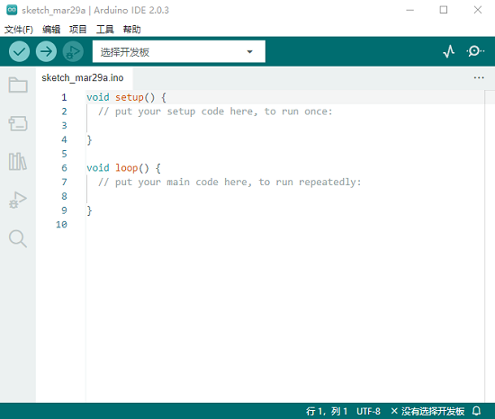

1.4. 在Arduino IDE上安装ESP32：

上面已经学习了怎么下载ArduinoIDE和怎么安装驱动，那下面就要在Arduino IDE上安装ESP32，请执行以下步骤：

特别注意：你需要Arduino IDE 1.8.5或更高版本才能在其上安装ESP32。

(1)点击电脑桌面上的图标，打开Arduino IDE。

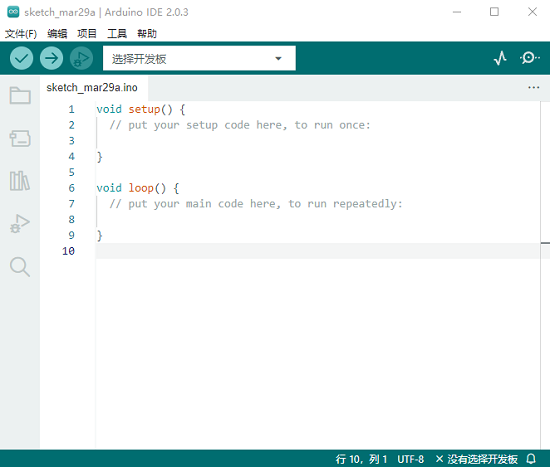

(2)点击“文件” →“首选项”，如下图：

(3)打开下图标出的按钮。

(4)将这个地址：https://espressif.github.io/arduino-esp32/package_esp32_index.json ，复制粘贴到里面去再点击“**确定**”保存这个地址，如下图：

(5)再点击“**确定**”。

（6）先点击“**工具**”→“**开发版:**”，，再点击“**开发版管理器...**”进入“**开发版管理器**”页面，在文本框中输入“**esp32**”，选择 1.06 版本进行安装，安装包不大，点击“**安装**”开始安装相关安装包。如下图：**（特别提醒：选择更高版本或最新版本，可能会出现安装失败。）**

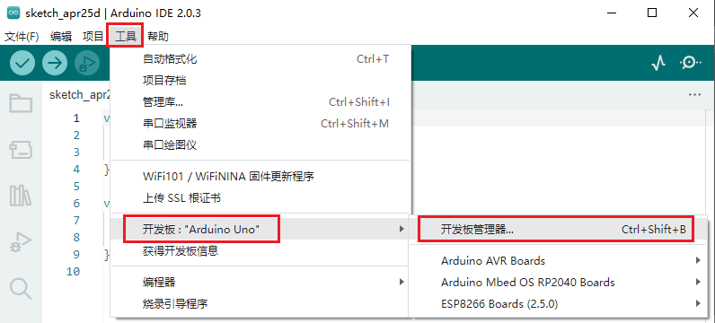

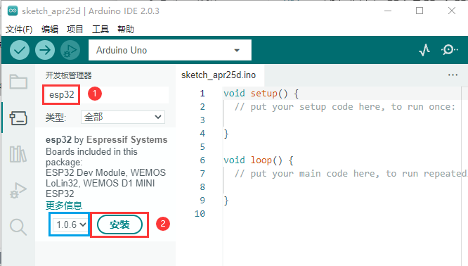

（7）点击“**工具**”→“**开发版:**”，就可以看到安装好的ESP32 Arduino，你可以在里面查看到各种不同型号ESP32开发板，选择对应的ESP32开发板型号。

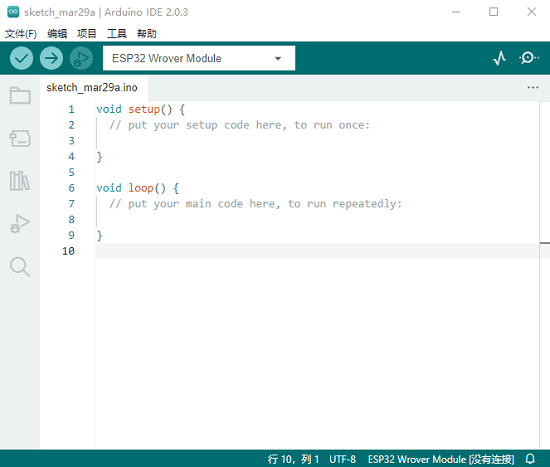

（8）设置好板型后，再选择正确的COM口（安装驱动成功后可看到对应COM口），设置如下图。

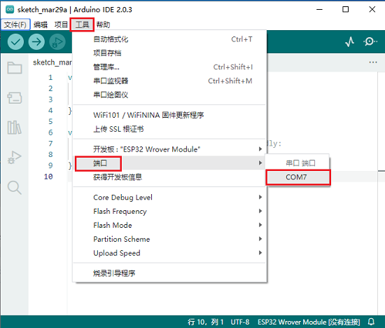

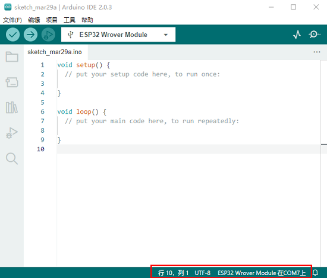

**2.Mac系统:**

2.1.下载安装Arduino IDE:

进入Arduino官方网站：https://www.arduino.cc/ ，点击“**SOFTWARE**”进入下载页面，如下图所示：

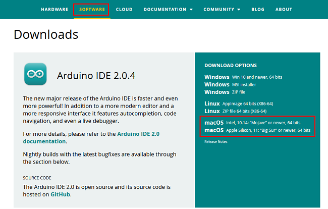

2.2.如何安装CP2102驱动程序：

（注意：如果已经安装了驱动程序，则不需要再安装驱动；如果没有，则需要进行以下操作）
（1）用USB线将ESP32主板连接到你的MacOS系统电脑上，并打开Arduino IDE。

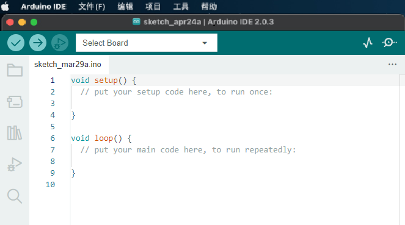

（2）CP2102驱动下载链接：[https://cn.silabs.com/developers/usb-to-uart-bridge-vcp-drivers?tab=downloads](https://cn.silabs.com/developers/usb-to-uart-bridge-vcp-drivers?tab=downloads)

（3）点击下载MacOS 版本。

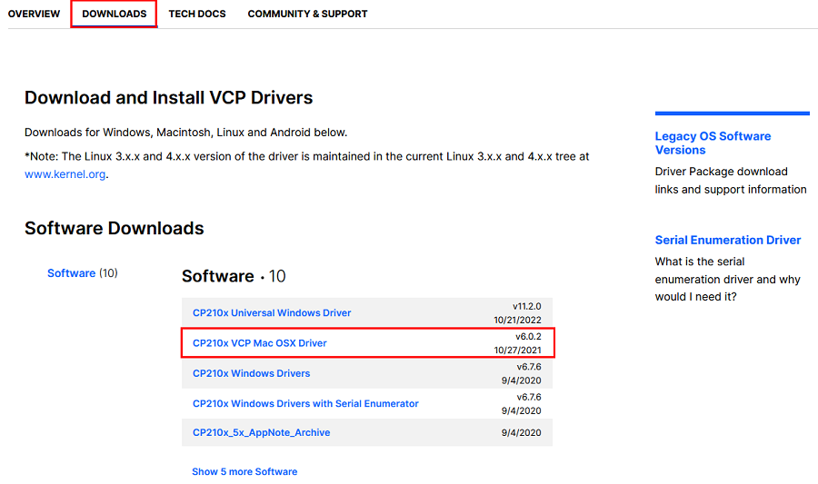

（4）解压下载好的压缩包。

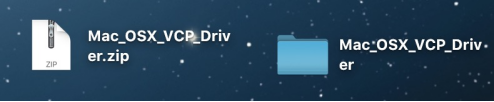

（5）打开文件夹，双击“SiLabsUSBDriverDisk.dmg”文件。

可以看到以下文件。

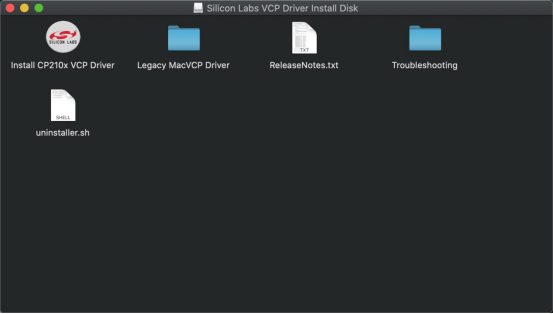

（6）双击“Install CP210x VCP Driver”，勾选“Don’t warn me when opening application on this disk image”并单击“Open”。

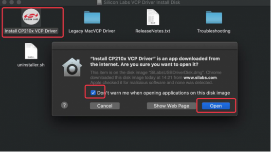

（7）单击“Continue”。

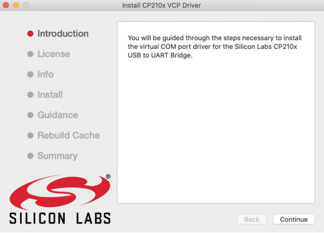

（8）先点击“Agree”，然后点击“Continue”。

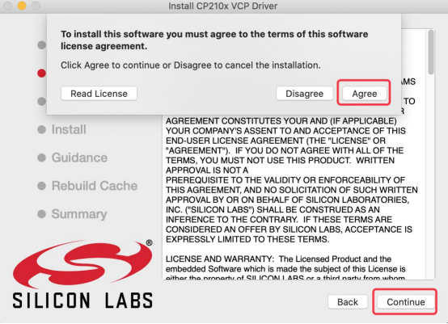

（9）继续点击“Continue”，然后输入你的用户密码

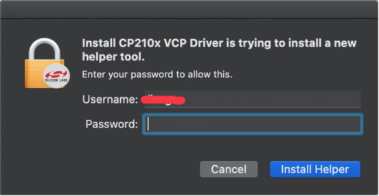

（10）选择“Open Security Preferences”。

（11）点击安全锁，输入你的用户密码来授权。

（12）看到锁被打开了，点击“Allow”。

（13）回到安装界面，根据提示等待安装.

（14）安装成功

2.3. 在Arduino IDE上安装ESP32：

上面已经学习了怎么下载ArduinoIDE和怎么安装驱动，那下面就要在Arduino IDE上安装ESP32，请执行以下步骤：

特别注意：你需要Arduino IDE 1.8.5或更高版本才能在其上安装ESP32。

(1)点击电脑桌面上的图标，打开Arduino IDE。点击“Arduino IDE” →“首选项”，如下图：

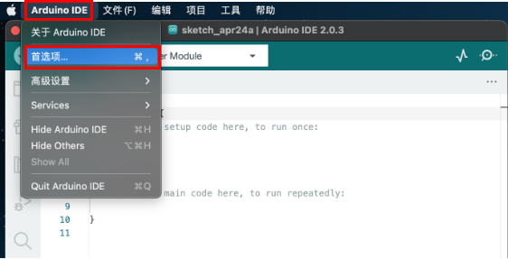

(2)打开下图标出的按钮

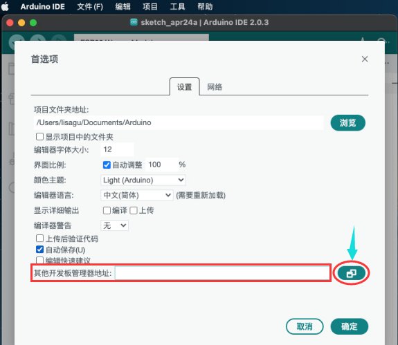

(3)将这个地址：https://espressif.github.io/arduino-esp32/package_esp32_index.json ，复制粘贴到里面去再点击“**确定**”保存这个地址，如下图：

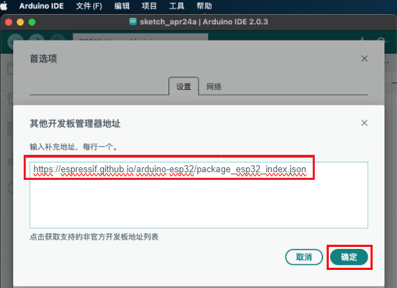

(4)再点击“**确定**”。

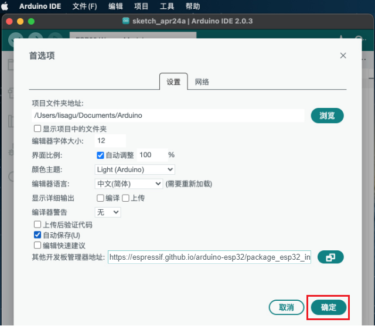

（5）先点击“**工具**”→“**开发版:**”，，再点击“**开发版管理器...**”进入“**开发版管理器**”页面，在文本框中输入“**esp32**”，选择 1.06 版本进行安装，安装包不大，点击“**安装**”开始安装相关安装包。如下图：**（特别提醒：选择更高版本或最新版本，可能会出现安装失败。）**

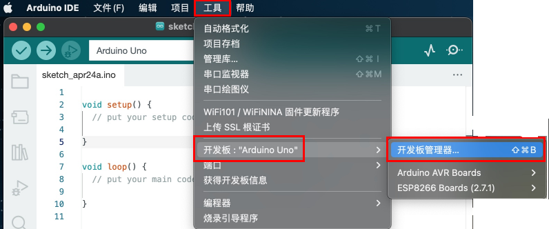

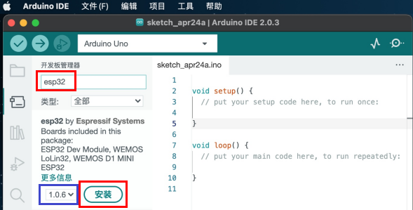

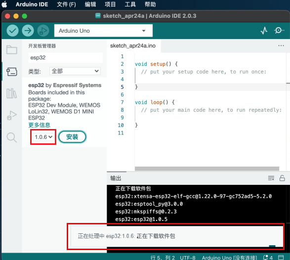

（6）点击“**工具**”→“**开发版:**”，就可以看到安装好的ESP32 Arduino，你可以在里面查看到各种不同型号ESP32开发板，选择对应的ESP32开发板型号。

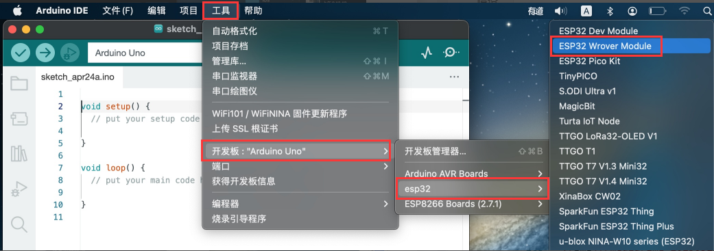

（7）设置好板型后，再选择正确的COM口（安装驱动成功后可看到对应COM口），设置如下图。

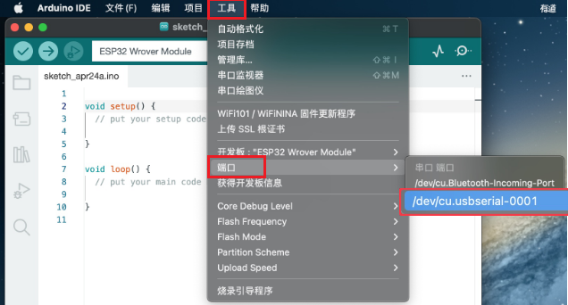

**3.添加arduino库文件**

特别提醒：库文件在上面 **资料下载** 处提供有，请下载并且安装好库文件。

我们提供的Arduino库文件的路径：**..库文件\Arduino_C_Windows系统**。如下图：

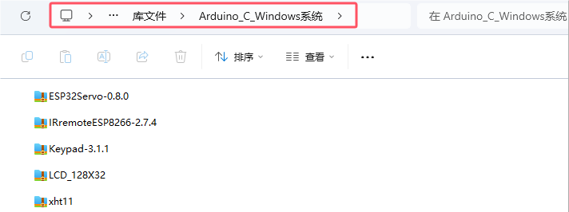

3.1. Windows系统添加库文件的方法：

（1）打开Arduino IDE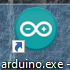，在Arduino IDE界面点击“**项目**”→“**包含库**”→“**添加.ZIP库...**”。

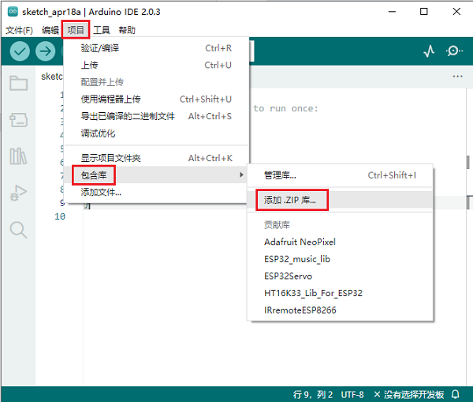

（2）找到库文件存放的位置，选中对应的库文件，点击“**打开**”添加即可。库文件只能一个一个的添加。（注意：库文件需要压缩为 **.ZIP格式**；这里以“**ESP32Servo-0.8.0.ZIP**”为演示，其他库文件的添加方法是一样的。）

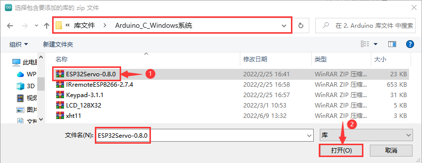

3.2. MacOS系统的库文件添加方法: 

（1）arduino IDE界面选择“**项目**” > “**包含库**” > “**添加.ZIP库...**”。

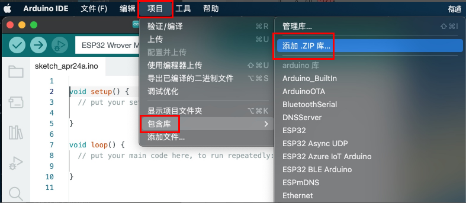

（2）找到库文件存放的位置，选中对应的库文件，点击“**打开**”添加即可。库文件只能一个一个的添加。（这里以添加“ESP32Servo-0.8.0.ZIP”库文件为例，其他库文件的添加方法一样），如下图：

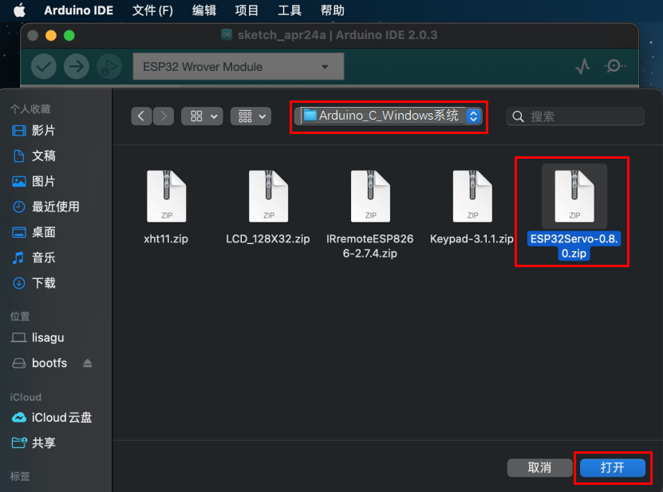

到这，正常是安装成功的了。

