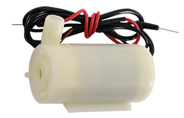
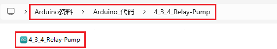
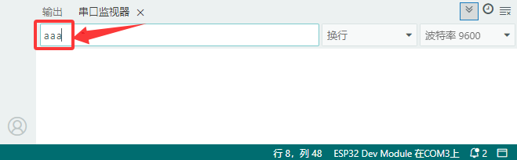

### 4.3.4 继电器+水泵

#### 4.3.4.1 简介

本教程将为您详细介绍5V继电器模块和水泵模块的使用方法和应用技巧。水泵模块是一种用于输送液体的设备，广泛应用于农业灌溉、水族箱管理和工业流体控制；5V继电器模块是一种电子开关设备，能够通过低电压控制高电压或大电流电路的通断。教程内容包括水泵模块和5V继电器模块的工作原理、引脚功能、电路连接方法以及如何通过微控制器（如ESP32）控制控制继电器的开关状态从而最终控制水泵的开关和运行状态。您将学习如何编写代码来实现继电器的自动控制水泵模块，并应用于各种场景，如农业灌溉、水族箱管理和工业流体控制。无论您是电子初学者还是有经验的开发者，本教程都将帮助您掌握5V继电器模块和水泵模块的应用，为您的项目增添高效的液体输送解决方案。

#### 4.3.4.2 元件知识



水泵模块基于电机的工作原理，通过电机驱动叶轮或活塞运动，将液体从低压区域输送到高压区域。其核心是将电能转换为机械能，再转换为液体的动能，广泛应用于家用、农业、工业等领域。

⚠️ **注意：水泵跟电机一样是不能直接使用开发板的IO口进行驱动的，否则将可能会烧坏开发板。**

**水泵拆解图：**


**继电器：** 是一种电子控制器件，它具有控制系统（又称输入回路）和被控制系统（又称输出回路），通常应用于自动控制电路中，它实际上是用较小的电流去控制较大电流的一种“自动开关”。故在电路中起着自动调节、安全保护、转换电路等作用。下面是一个常用继电器的示意图:


引脚名称及其描述：

- V：电源正极，提供必要的电能。
- G：电源负极，与正极共同构成电流回路。
- S：控制信号，用于控制继电器的开关状态。
- NO：常开接口，在无控制信号时处于断开状态，有信号时闭合。
- COM：公共端接口，与常开、常闭接口相连，构成触点。
- NC：常闭接口，在无控制信号时处于闭合状态，有信号时断开。

**工作原理图：**


一个继电器拥有一个动触点以及两个静触点A和B。

当开关K断开时，继电器线路无电流通过，此时动触点与静触点B相接触，上半部分的电路导通。静触点B被称为常闭触点（NC）。常闭——NC（normal close）通常情况下是关合状态，即线圈未得电的情况下闭合的。

当开关K闭合时，继电器电路通过电流产生磁力，此时动触点与静触点A相接触，下半部分电路导通。静触点A被称为常开触点（NO）。常开——NO（normal open）通常情况下是断开状态，即线圈未得电的情况下断开的。

而动触点也被称为公共触点（COM）。

继电器简单来说就是一个开关，VCC表示电源正极、GND表示电源负极、S表示信号脚，COM表示公共接口，NC（normal close）表示常闭接口，NO(normal open)表示常开接口。

继电器能兼容多种单片机控制板，是用小电流去控制大电流运作的一种“自动开关”。它可以让单片机控制板驱动3A以下负载，如LED灯带、直流马达、微型水泵、电磁阀可插拔式接口设计，方便使用。

**规格参数：**

- 供电电压：5V
- 静态电流：2mA
- 最高触点电压：250VAC/30VDC
- 最大电流：10A

**模块原理图：**


#### 4.3.4.3 接线图

- **继电器模块的S引脚连接到io25；继电器的NO端，连接到ESP32主板上的3V3引脚**

- **水泵：**
  - **红色线连接到继电器的COM端，如图所示**
  - **黑色线连接到ESP32主板上的GND引脚，如图所示**

⚠️ **特别注意：智慧农场已经组装好了，这里不需要把继电器模块和水泵拆下来又重新组装和接线，这里再次提供接线图，是为了方便您编写代码！**


#### 4.3.4.4 实验代码

代码文件在`Arduino_代码`文件夹中，代码文件为`4_3_4_Water_Pump`，如下图所示：



鼠标双击`4_3_4_Water_Pump.ino`即可在Arduino IDE中打开。

```c++
/*
 * 文件名 : Relay-Pump
 * 功能   : 让继电器控制水泵抽水模拟抽水系统
 * 编译IDE：ARDUINO 2.3.6
 * 作者   : https://www.keyesrobot.cn/
*/

const int RelayPin = 25; //定义继电器引脚为IO25

char content;  //定义一个字符串，用于存储串口接收到的值

void setup() {
  Serial.begin(9600);
  pinMode(RelayPin,OUTPUT); //定义引脚IO25为输出模式
}

void loop() {
  //arduino串口方法Serial.read() 每次只接收一个字节
  //当键盘输入aaa时，每次只接收一个a，共接收三次
  if(Serial.available() > 0) {
    if (Serial.read() == 'a') //当输入的值等于a时，执行灌溉任务
    {
      digitalWrite(RelayPin,HIGH);
      delay(400);//灌溉的延时，请设置100~400之间
      digitalWrite(RelayPin,LOW);
      delay(700);
    }
  }
}
```

#### 4.3.4.5 实验结果

按照接线图接好线，外接电源，选择好正确的开发板板型（ESP32 Dev Module）和 适当的串口端口（COMxx），然后单击按钮上传代码。上传代码成功后，单击Arduino IDE右上角的打开串监视器串口并设置串口波特率为`9600`。 在文本框中，当键盘输入“aaa”时，然后按一下键盘上的Enter键，ESP32主控板每次只接收一个“a”，共接收三次，则继电器控制水泵会进行三次抽水。




通过这个项目，我们可以实现自动化的抽水泵控制，从而减少手动操作的时间和精力成本，提高生产效率。这种方法可以应用于多个领域，例如农业生产、水处理等。

#### 4.3.4.6 代码说明

| 代码                | 说明                                                         |
| ------------------- | ------------------------------------------------------------ |
| char content        | 定义一个字符串，用于存储串口接收到的值。 |
| Serial.begin(9600)  | 设置波特率为9600。 |
| Serial.available( ) | 获取串口上可读取的数据的字节数，该数据已经到达并存储在接收缓存（共有64字节）中。Serial.available() > 0表示串口接收到了数据，可以读取。|
| Serial.read( )      | 读取写入的串行数据。|
| if( ){ }      | 如果“（ ）”里的条件满足，则执行“{ }”里的程序。|