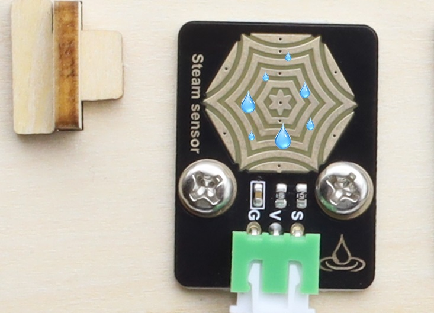

### 4.3.10 水滴传感器

#### 4.3.10.1 简介

本教程将为您详细介绍水滴传感器的使用方法和应用技巧。水滴传感器是一种能够检测水存在的传感器，广泛应用于雨水检测等领域。教程内容包括水滴传感器的工作原理、引脚功能、电路连接方法以及如何通过微控制器（如ESP32）读取雨水量的模拟值。您将学习如何编写代码来传感器上实时雨水量的多少。无论您是电子初学者还是有经验的开发者，本教程都将帮助您掌握水滴传感器的应用，为您的项目增添精确的雨水检测功能。

#### 4.3.10.2 元件知识

**水滴传感器：** 是一种可用于检测水的存在的传感器，它通常用于雨水检测系统。当雨水接触到传感器上的导电垫（检测区）时，它会向开发板(例如：Arduino主板，ESP32主板等)发送信号，以触发各种动作。


**原理图：**


水滴传感器通过电路板上裸露的印刷平行线检测水量的大小。水量越多，就会有更多的导线被联通，随着导电的接触面积增大，雨滴感应区 2 脚输出的电压就会逐步上升，信号端 S 检测到的模拟值就越大。除了可以检测水量的大小，它还可以检测空气中的水蒸气。

**参数：**

- 工作电压: DC 3.3V~5V
- 工作电流: (Max) 1.5mA@5V
- 最大功率: 0.075W
- 信号类型: 模拟信号

#### 4.3.10.3 接线图

- **水滴传感器的S引脚连接到io35**

⚠️ **特别注意：智慧农场已经组装好了，这里不需要把水滴传感器拆下来又重新组装和接线，这里再次提供接线图，是为了方便您编写代码！**


#### 4.3.10.4 实验代码

代码文件在`Arduino_代码`文件夹中，代码文件为`4_3_10_Steam-Sensor`，如下图所示：


鼠标双击`4_3_10_Steam-Sensor.ino`即可在Arduino IDE中打开。

```c++
/*
 * 文件名 : Steam-Sensor
 * 功能   : 读取水滴传感器的值
 * 编译IDE：ARDUINO 2.3.6
 * 作者   : https://www.keyesrobot.cn/
*/

const int SteamPin = 35;   //定义引脚为35

void setup() {
  Serial.begin(9600); //初始化串口
  pinMode(SteamPin,INPUT); //设置水滴传感器引脚为输入模式
}

void loop() {
  //读取水滴传感器的值
  int ReadValue = analogRead(SteamPin);
  Serial.print("Steam Value: ");
  Serial.println(ReadValue);
  delay(500);
}
```

#### 4.3.10.5 实验结果

按照接线图接好线，外接电源，选择好正确的开发板板型（ESP32 Dev Module）和 适当的串口端口（COMxx），然后单击按钮上传代码。上传代码成功后，单击Arduino IDE右上角的打开串口监视器窗口并设置串口波特率为`9600`，即可通过串口打印窗口查看水滴传感器的模拟值，用湿润的手指去触碰传感器上的检测区域，触碰的面积越大，接收到的值就越大。 



**串口现象图：**

