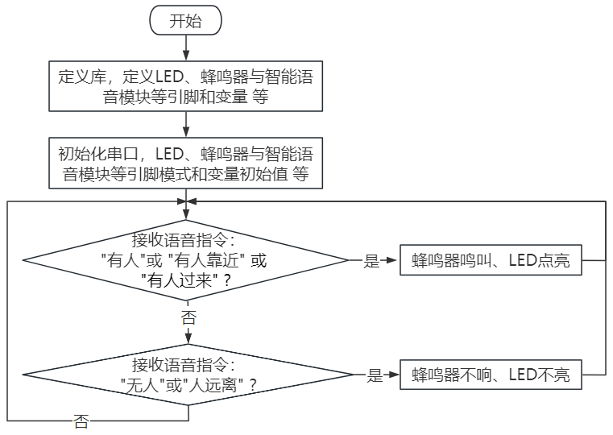
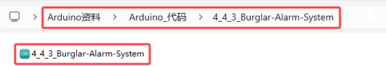

### 4.4.3 防盗警报系统

#### 4.4.3.1 简介

智能语音模块、LED和蜂鸣器组成的防盗报警系统，可以使用ESP32开发板进行控制。使用Arduino IDE进行编程，如果发现有人，唤醒智能语音模块，对着麦克风说：“有人” 或 “有人靠近” 或 “有人过来” 等命令词时，则蜂鸣器发出警报声，LED点亮。通过这种方式，可以实现低成本语音智能的防盗报警系统，适用于大型农场或大型商城等。


本课程将介绍如何使用智能语音模块、无源蜂鸣器和LED组合成一个基于Arduino ESP32的防盗警报系统。当发现有人在活动时，唤醒智能语音模块，对着麦克风说：“有人” 或 “有人靠近” 或 “有人过来” 等命令词时，蜂鸣器会发出警报声，同时LED会点亮，从而提醒使用者有人进入该区域。


#### 4.4.3.2 接线图

- **LED模块的S引脚连接到io27**

- **无源蜂鸣器的S引脚连接到io16**

- **智能语音模块的TXD引脚连接到io5，RXD引脚连接到io23**

⚠️ **特别注意：智慧农场已经组装好了，这里不需要把智能语音模块、无源蜂鸣器和LED模块拆下来又重新组装和接线，这里再次提供接线图，是为了方便您编写代码！**


#### 4.4.3.3 代码流程图



#### 4.4.3.4 实验代码

代码文件在`Arduino_代码`文件夹中，代码文件为`4_4_3_Burglar-Alarm-System`，如下图所示：



鼠标双击`4_4_3_Burglar-Alarm-System.ino`即可在Arduino IDE中打开。

```c++
/*
 * 文件名 : Burglar-Alarm-System
 * 功能   : 结合智能语音模块、LED模块和无源蜂鸣器模拟防盗警报系统
 * 编译IDE：ARDUINO 2.3.6
 * 作者   : https://www.keyesrobot.cn/
*/

//导入相关库文件
#include <SoftwareSerial.h>

// 定义引脚常量
const int RX_PIN = 23; // 引脚 GPIO23 为 RX
const int TX_PIN = 5; // 引脚 GPIO5 为 TX
const int buzzerPin = 16;        //蜂鸣器模块连接引脚为16
const int ledPin = 27;       // 定义LED的GPIO引脚为27

SoftwareSerial mySerial(RX_PIN, TX_PIN); // 定义软件串口引脚（RX, TX）

void setup() {
  Serial.begin(9600); // 硬件串口（与电脑通信）
  mySerial.begin(9600); // 软件串口（与外设通信）
  //设置引脚的模式
  pinMode(buzzerPin,OUTPUT);
  pinMode(ledPin,OUTPUT);
}

void loop() {
  if (mySerial.available()) { // 接收语音控制模块的外设数据
    int command = mySerial.read(); // 将接收到的外设数据进行赋值 
    if(command == 21){
      digitalWrite(ledPin,HIGH);
      //警报声
      for(int i = 200; i<=1000; i+=10){ 
        tone(buzzerPin,i);
        delay(10);
      }
    }
    else if(command == 22){
      noTone(buzzerPin);
      digitalWrite(ledPin,LOW);
    }
    mySerial.println(command);
    Serial.println(command);
  }  
}
```

#### 4.4.3.5 实验结果

按照接线图接好线，外接电源，选择好正确的开发板板型（ESP32 Dev Module）和 适当的串口端口（COMxx），然后单击按钮上传代码。上传代码成功后，通过智能语音模块来控制无源蜂鸣器和LED。

对着智能语音模块上的麦克风，使用唤醒词 “你好，小智” 或 “小智小智” 来唤醒智能语音模块，同时喇叭播放回复语 “有什么可以帮到您”；

智能语音模块唤醒后，对着麦克风说：“有人” 或 “有人靠近” 或 “有人过来” 等命令词时，喇叭播放对应的回复语 “是，有人正过来”，同时警报声响起来，警示灯也会点亮；

对着麦克风说：“无人” 或 “人远离” 等命令词时，喇叭播放对应的回复语 “是，没有人”，同时警报声不响，警示灯也不亮。

