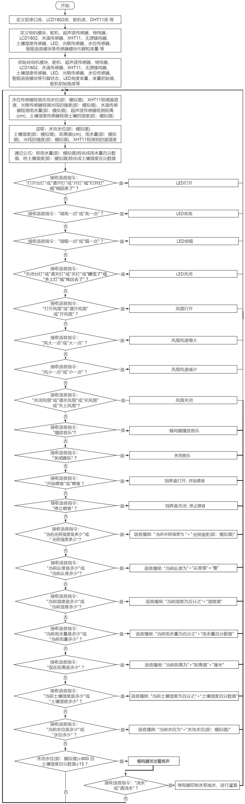

### 4.4.12 语音控制智能农场系统

⚠️ **请注意：** 使用设备时不要让水从水池和土壤池中溢出。如果水洒到其他传感器上，会导致短路，影响设备正常工作。另外，如果水洒到电池上，会导致发热和爆炸等危险。因此，请在使用设备时格外小心，尤其是幼儿使用时一定要在家长的监护下进行。为确保设备的安全运行，请遵循相关使用指南和安全规范。


#### 4.4.12.1 简介

经过前面一系列的语音控制项目的学习，我们是不是可以通过智能语音模块控制智能农场的所有传感器模块呢？当然是可以的。在本项目实验中，通过ESP32主控板控制所有传感器模块，然后通过智能语音模块进行实时语音播报智能农场的温湿度、水池水位、土壤湿度、光照强度、距离和雨水量等。同时，它还能控制LED灯进行照明，控制水泵进行灌溉，控制饲料盒进行喂养，控制电机模块调整农场的温湿度和音乐播放等。


#### 4.4.12.2 接线图

⚠️ **特别注意：智慧农场已经组装好了，这里不需要把所有的传感器和模块都拆下来又重新组装和接线。由于传感器和模块较多，接线图中的接线复杂会导致传感器和模块的引脚接线看不清，所以使用表格来表示传感器和模块的引脚连接到ESP32主控板上的对应引脚，也是为了方便您编写代码！**

| 编号 |      传感器模块        |      ESP32主板 S 引脚       |  ESP32主板 V 引脚 |  ESP32主板 G 引脚 |
| :--: | :------------------:  | :------------------------: |:---------------: |:---------------: |
|  1   |         风扇          |    io18(IN-) \| io19(IN+)     |        V         |         G        |
|  2   |      超声波传感器      |    io14(TRIG) \| io13(ECHO)    |        V         |         G        |
|  3   |      LCD1602模块      |  I2C（SDA(io21) \| SCL(io22)） |        V         |         G        |
|  4   |   XHT11温湿度传感器    |            io17             |        V         |         G        |
|  5   |      水滴传感器        |            io35             |        V         |         G        |
|  6   |      光敏传感器        |            io34             |        V         |         G        |
|  7   |        舵 机           |            io26             |        V         |         G        |
|  8   |      无源蜂鸣器        |            io16             |        V          |         G        |
|  9   |       LED模块          |            io27             |        V         |          G       |
|  10  |      水位传感器        |            io33             |        V         |          G        |
|  11  |     土壤湿度传感器     |            io32             |        V         |          G        |
|  12  |      继电器水泵        |            io25             |        V         |          G        |
|  13  |      智能语音模块      |    io23(RXD) \| io5(TXD)    |        V         |          G        |


#### 4.4.12.3 代码流程图



#### 4.4.12.4 实验代码

代码文件在`Arduino_代码`文件夹中，代码文件为`4_4_12_Voice-Controll-Smart-Farm`，如下图所示：


鼠标双击`4_4_12_Voice-Controll-Smart-Farm.ino`即可在Arduino IDE中打开。

⚠️ **注意：代码中的条件阈值可以根据实际情况自行设置。**

```c++
/*
 * 文件名 : Voice-Controll-Smart-Farm
 * 功能   : 结合智能语音控制模块和所有传感器模拟语音控制智能农场系统
 * 编译IDE：ARDUINO 2.3.6
 * 作者   : https://www.keyesrobot.cn/
*/

// 导入库文件
#include <SoftwareSerial.h>
#include <Wire.h>
#include <LiquidCrystal_I2C.h>
#include <ESP32Servo.h> 
#include <dht11.h> 
Servo myservo;  // 创建舵机对象来控制舵机,在ESP32上可以创建16个舵机对象

// 定义引脚常量
const int PhotoresistorPin = 34;  // 定义光敏传感器引脚
const int LED_PIN = 27;  // 定义LED引脚
const int SteamPin = 35;   // 定义水滴传感器引脚
const int BuzzerPin = 16; // 定义无源蜂鸣器引脚
const int MotorPin1 = 19; // (IN+)
const int MotorPin2 = 18; // (IN-)
const int TrigPin = 14; // trig接GPIO14
const int EchoPin = 13; // echo接GPIO13
const int ServoPin = 26; // 舵机的引脚
const int DHT11PIN = 17; // 温湿度传感器的引脚
const int SoilHumidityPin = 32;  // 定义土壤湿度传感器引脚
const int WaterLevelPin = 33;  // 定义水位传感器引脚
const int RelayPin = 25;  // 定义继电器引脚
const int RX_PIN = 23; // 引脚 GPIO23 为 RX
const int TX_PIN = 5; // 引脚 GPIO5 为 TX

SoftwareSerial mySerial(RX_PIN, TX_PIN); // 定义软件串口引脚（RX, TX）
LiquidCrystal_I2C lcd(0x27, 16, 2); // 定义LCD地址和行列
dht11 DHT11; // 初始化dht11

// LED亮度等级
const int LED_OFF = 0;
const int LED_DIM = 50;
const int LED_MEDIUM = 150;
const int LED_BRIGHT = 255;

// 定义变量
volatile int yuyin;
volatile int ReadValue;
volatile double AnalogValue;
volatile int Value1;
volatile int distance;
volatile int duration;
volatile int Temperature;
volatile int Humidity;
volatile double Soilhum;
volatile int Waterlevel;
volatile int Value2;

// 串口发送消息最大长度
#define UART_SEND_MAX      32
#define UART_MSG_HEAD_LEN  2
#define UART_MSG_FOOT_LEN  2

// 串口发送消息号
#define U_MSG_bozhensgshu      1
#define U_MSG_boxiaoshu      2
#define U_MSG_bobao1      3
#define U_MSG_bobao2      4
#define U_MSG_bobao3      5
#define U_MSG_bobao4      6
#define U_MSG_bobao5      7
#define U_MSG_bobao6      8
#define U_MSG_bobao7      9
#define U_MSG_bobao8      10
#define U_MSG_bobao9      11
#define U_MSG_bobao10      12
#define U_MSG_bobao11      13
#define U_MSG_bobao12      14
#define U_MSG_bobao13      15
#define U_MSG_bobao14      16
#define U_MSG_bobao15      17
#define U_MSG_bobao16      18
#define U_MSG_bobao17      19
#define U_MSG_bobao18      20

// 串口消息参数类型
typedef union {
  double d_double;
  int d_int;
  unsigned char d_ucs[8];
  char d_char;
  unsigned char d_uchar;
  unsigned long d_long;
  short d_short;
  float d_float;}uart_param_t;

// 串口发送函数实现
void _uart_send_impl(unsigned char* buff, int len) {
  // TODO: 调用项目实际的串口发送函数
  for(int i=0;i<len;i++){
    mySerial.write (*buff++);
  }
}

// 串口通信消息尾
const unsigned char g_uart_send_foot[] = {
  0x55, 0xaa
};

// 十六位整数转32位整数
void _int16_to_int32(uart_param_t* param) {
  if (sizeof(int) >= 4)
    return;
  unsigned long value = param->d_long;
  unsigned long sign = (value >> 15) & 1;
  unsigned long v = value;
  if (sign)
    v = 0xFFFF0000 | value;
  uart_param_t p;  p.d_long = v;
  param->d_ucs[0] = p.d_ucs[0];
  param->d_ucs[1] = p.d_ucs[1];
  param->d_ucs[2] = p.d_ucs[2];
  param->d_ucs[3] = p.d_ucs[3];
}

// 浮点数转双精度
void _float_to_double(uart_param_t* param) {
  if (sizeof(int) >= 4)
    return;
  unsigned long value = param->d_long;
  unsigned long sign = value >> 31;
  unsigned long M = value & 0x007FFFFF;
  unsigned long e =  ((value >> 23 ) & 0xFF) - 127 + 1023;
  uart_param_t p0, p1;
  p1.d_long = ((sign & 1) << 31) | ((e & 0x7FF) << 20) | (M >> 3);
  param->d_ucs[0] = p0.d_ucs[0];
  param->d_ucs[1] = p0.d_ucs[1];
  param->d_ucs[2] = p0.d_ucs[2];
  param->d_ucs[3] = p0.d_ucs[3];
  param->d_ucs[4] = p1.d_ucs[0];
  param->d_ucs[5] = p1.d_ucs[1];
  param->d_ucs[6] = p1.d_ucs[2];
  param->d_ucs[7] = p1.d_ucs[3];
}

// 串口通信消息头
const unsigned char g_uart_send_head[] = {
  0xaa, 0x55
};

//把获取超声波检测的距离，写在一个函数里
float getDistance() {
  digitalWrite(TrigPin,LOW);
  delayMicroseconds(2);
  digitalWrite(TrigPin,HIGH);
  delayMicroseconds(10);	//给trig至少10us的高电平时间触发
  digitalWrite(TrigPin,LOW);
  duration = pulseIn(EchoPin,HIGH);	//echo高电平的时间
  distance = duration/58;		//换算成距离，单位为cm
  delay(50);  
  return distance;
}
// 播报函数1
void _uart_bobao1() {
  uart_param_t param;
    int i = 0;
    unsigned char buff[UART_SEND_MAX] = {0};
    for (i = 0; i < UART_MSG_HEAD_LEN; i++) {
        buff[i + 0] = g_uart_send_head[i];
    }
    buff[2] = U_MSG_bobao1;
    for (i = 0; i < UART_MSG_FOOT_LEN; i++) {
        buff[i + 3] = g_uart_send_foot[i];
    }
    _uart_send_impl(buff, 5);
}

// 播报函数2
void _uart_bobao2() {
  uart_param_t param;
    int i = 0;
    unsigned char buff[UART_SEND_MAX] = {0};
    for (i = 0; i < UART_MSG_HEAD_LEN; i++) {
        buff[i + 0] = g_uart_send_head[i];
    }
    buff[2] = U_MSG_bobao2;
    for (i = 0; i < UART_MSG_FOOT_LEN; i++) {
        buff[i + 3] = g_uart_send_foot[i];
    }
    _uart_send_impl(buff, 5);
}
// 播报函数3
void _uart_bobao3() {
  uart_param_t param;
    int i = 0;
    unsigned char buff[UART_SEND_MAX] = {0};
    for (i = 0; i < UART_MSG_HEAD_LEN; i++) {
        buff[i + 0] = g_uart_send_head[i];
    }
    buff[2] = U_MSG_bobao3;
    for (i = 0; i < UART_MSG_FOOT_LEN; i++) {
        buff[i + 3] = g_uart_send_foot[i];
    }
    _uart_send_impl(buff, 5);
}

// 播报函数4
void _uart_bobao4() {
  uart_param_t param;
    int i = 0;
    unsigned char buff[UART_SEND_MAX] = {0};
    for (i = 0; i < UART_MSG_HEAD_LEN; i++) {
        buff[i + 0] = g_uart_send_head[i];
    }
    buff[2] = U_MSG_bobao4;
    for (i = 0; i < UART_MSG_FOOT_LEN; i++) {
        buff[i + 3] = g_uart_send_foot[i];
    }
    _uart_send_impl(buff, 5);
}

// 播报函数5
void _uart_bobao5() {
  uart_param_t param;
    int i = 0;
    unsigned char buff[UART_SEND_MAX] = {0};
    for (i = 0; i < UART_MSG_HEAD_LEN; i++) {
        buff[i + 0] = g_uart_send_head[i];
    }
    buff[2] = U_MSG_bobao5;
    for (i = 0; i < UART_MSG_FOOT_LEN; i++) {
        buff[i + 3] = g_uart_send_foot[i];
    }
    _uart_send_impl(buff, 5);
}

// 播报函数6
void _uart_bobao6() {
  uart_param_t param;
    int i = 0;
    unsigned char buff[UART_SEND_MAX] = {0};
    for (i = 0; i < UART_MSG_HEAD_LEN; i++) {
        buff[i + 0] = g_uart_send_head[i];
    }
    buff[2] = U_MSG_bobao6;
    for (i = 0; i < UART_MSG_FOOT_LEN; i++) {
        buff[i + 3] = g_uart_send_foot[i];
    }
    _uart_send_impl(buff, 5);
}

// 播报函数7
void _uart_bobao7() {
  uart_param_t param;
    int i = 0;
    unsigned char buff[UART_SEND_MAX] = {0};
    for (i = 0; i < UART_MSG_HEAD_LEN; i++) {
        buff[i + 0] = g_uart_send_head[i];
    }
    buff[2] = U_MSG_bobao7;
    for (i = 0; i < UART_MSG_FOOT_LEN; i++) {
        buff[i + 3] = g_uart_send_foot[i];
    }
    _uart_send_impl(buff, 5);
}

// 播报函数9
void _uart_bobao9() {
  uart_param_t param;
    int i = 0;
    unsigned char buff[UART_SEND_MAX] = {0};
    for (i = 0; i < UART_MSG_HEAD_LEN; i++) {
        buff[i + 0] = g_uart_send_head[i];
    }
    buff[2] = U_MSG_bobao9;
    for (i = 0; i < UART_MSG_FOOT_LEN; i++) {
        buff[i + 3] = g_uart_send_foot[i];
    }
    _uart_send_impl(buff, 5);
}

// 播报函数16
void _uart_bobao16() {
  uart_param_t param;
    int i = 0;
    unsigned char buff[UART_SEND_MAX] = {0};
    for (i = 0; i < UART_MSG_HEAD_LEN; i++) {
        buff[i + 0] = g_uart_send_head[i];
    }
    buff[2] = U_MSG_bobao16;
    for (i = 0; i < UART_MSG_FOOT_LEN; i++) {
        buff[i + 3] = g_uart_send_foot[i];
    }
    _uart_send_impl(buff, 5);
}

// 播报整数
void _uart_bozhensgshu(int zhengshu) {
  uart_param_t param;
    int i = 0;
    unsigned char buff[UART_SEND_MAX] = {0};
    for (i = 0; i < UART_MSG_HEAD_LEN; i++) {
        buff[i + 0] = g_uart_send_head[i];
    }
    buff[2] = U_MSG_bozhensgshu;
    param.d_int = zhengshu;
    _int16_to_int32(&param);
    buff[3] = param.d_ucs[0];
    buff[4] = param.d_ucs[1];
    buff[5] = 0;
    buff[6] = 0;
    for (i = 0; i < UART_MSG_FOOT_LEN; i++) {
        buff[i + 7] = g_uart_send_foot[i];
    }
    _uart_send_impl(buff, 9);
}

void setup(){
   Serial.begin(9600); // 硬件串口（与电脑通信）
   mySerial.begin(9600); // 软件串口（与外设通信）
   ReadValue = 0; // 定义变量ReadValue初始值为0
   distance = 0; // 定义变量distance初始值为0 
   yuyin = 0;  // 定义变量yuyin初始值为0 
   AnalogValue = 0; // 定义变量AnalogValue初始值为0
   Value1 = 0; // 定义变量Value1初始值为0
   Temperature = 0; // 定义变量Temperature初始值为0
   Humidity = 0; // 定义变量Humidity初始值为0
   Soilhum = 0; // 定义变量Soilhum初始值为0 
   Waterlevel = 0; // 定义变量Waterlevel初始值为0 
   Value2 = 0; // 定义变量Value2初始值为0 
   Wire.begin(21,22); // 定义LCD通信引脚
   lcd.init(); // 初始化LCD
   lcd.backlight(); // 打开LCD背光
   lcd.display(); // 打开LCD显示
   lcd.clear(); // LCD清屏
   pinMode(SteamPin, INPUT); // 设置水滴传感器引脚为输入模式
   pinMode(BuzzerPin, OUTPUT); // 设置蜂鸣器引脚为输出模式
   pinMode(PhotoresistorPin, INPUT); // 设置光敏引脚为输入模式
   pinMode(MotorPin1,OUTPUT); // 设置MotorPin1(IN+)引脚为输出模式
   pinMode(MotorPin2,OUTPUT); // 设置MotorPin2(IN-)引脚为输出模式
   pinMode(LED_PIN, OUTPUT); // 设置LED引脚为输出模式
   pinMode(TrigPin,OUTPUT);  // trig设置为输出模式
   pinMode(EchoPin,INPUT);   // echo设置为输入模式
   pinMode(SoilHumidityPin,INPUT);
   pinMode(WaterLevelPin,INPUT);
   pinMode(RelayPin,OUTPUT);
   myservo.attach(ServoPin);   // 将引脚io26上的舵机连接到舵机对象上
   myservo.write(180); // 舵机角度为180°
   delay(1000); // 延时1s
   //配置LEDC渠道
   ledcAttachChannel(BuzzerPin, 1000, 8, 4);
}

void loop(){
    //获取温湿度数据
   int chk = DHT11.read(DHT11PIN); 
   Temperature = DHT11.temperature;
   Humidity = DHT11.humidity;
   ReadValue = analogRead(PhotoresistorPin); // 读取光敏传感器的模拟值
   AnalogValue = analogRead(SteamPin); // 获取水滴传感器的模拟值
   Value1 = round((AnalogValue / 4096.0) * 100); //将传感器模拟值通过计算转化成百分数赋于变量Value1
   Soilhum = analogRead(32); // 存储读取到的土壤湿度模拟值
   Waterlevel = analogRead(33); // 存储读取到的水位模拟值
   Value2 = round((Soilhum / 4096.0) * 100); // 将土壤湿度模拟值通过计算转化成百分数赋于变量Value2
   distance = getDistance();
   lcd.setCursor(1, 0);
   lcd.print("Voice Controll");
   // 在LCD对应位置显示湿度相关信息
   lcd.setCursor(3, 1);
   lcd.print("Smart Farm");
   if (mySerial.available() > 0) { // 接收语音控制模块的外设数据(命令参数)
     yuyin = mySerial.read(); // 将接收到的外设数据(命令参数)进行赋值
     Serial.println(yuyin);  // 串口打印收到的外设数据(命令参数)
     if (yuyin == 1) { // 接收到的外设数据(命令参数)为1, 打开LED,灯的亮度为150
       analogWrite(LED_PIN, LED_MEDIUM);
    }
     if (yuyin == 2) { // 接收到的数据为2,关闭灯
       analogWrite(LED_PIN, LED_OFF);
    }
     if (yuyin == 3) { // 接收到的数据为3,灯的亮度为最亮
       analogWrite(LED_PIN, LED_BRIGHT); 
    } 
     if (yuyin == 4) { // 接收到的数据为4,灯的亮度为暗
       analogWrite(LED_PIN, LED_DIM); 
    }
     if (yuyin == 5) { // 接收到的外设数据(命令参数)为5, 打开风扇, 风速为100
       analogWrite(MotorPin1, 100);
       analogWrite(MotorPin2, 0);
    }
     if (yuyin == 7) { // 接收到的外设数据(命令参数)为7, 风大一点, 风速为200
       analogWrite(MotorPin1, 200);
       analogWrite(MotorPin2, 0);
    }
     if (yuyin == 8) { // 接收到的外设数据(命令参数)为8, 风小一点, 风速为100
       analogWrite(MotorPin1, 100);
       analogWrite(MotorPin2, 0);
    }
     if (yuyin == 6) { // 接收到的外设数据(命令参数)为6, 关闭风扇
       analogWrite(MotorPin1, 0);
       analogWrite(MotorPin2, 0);
    }
     if (yuyin == 11) { // 接收到的外设数据(命令参数)为11, 播放音乐
       ledcWriteTone(BuzzerPin, 262);
       delay(200);
       ledcWriteTone(BuzzerPin, 294);
       delay(200);
       ledcWriteTone(BuzzerPin, 330);
       delay(200);
       ledcWriteTone(BuzzerPin, 349);
       delay(200);
       ledcWriteTone(BuzzerPin, 392);
       delay(200);
       ledcWriteTone(BuzzerPin, 440);
       delay(200);
       ledcWriteTone(BuzzerPin, 494);
       delay(200);
       ledcWriteTone(BuzzerPin, 0);
       delay(200);
    }
     if (yuyin == 12) { // 接收到的外设数据(命令参数)为12, 关闭音乐
       ledcWriteTone(BuzzerPin, 0);
    }
     if (yuyin == 34) { // 接收到的外设数据(命令参数)为34, 开始喂食
       myservo.write(80); // 舵机角度为80°
       delay(1000); // 延时1s
    }
     if (yuyin == 35) { // 接收到的外设数据(命令参数)为35, 停止喂食
       myservo.write(180); // 舵机角度为180°
       delay(1000); // 延时1s
    }
     if (yuyin == 47) { // 进行判断，接收到的外设数据(命令参数)为47，检测温度并且进行语音播报
        yuyin = 0;
        delay(2000);
        _uart_bobao1();
        delay(2000);
        _uart_bozhensgshu(Temperature);
        delay(2000);
        _uart_bobao2();
        delay(2000);
    }
     if (yuyin == 48) { // 进行判断，接收到的外设数据(命令参数)为48，检测湿度并且进行语音播报
        yuyin = 0;
        delay(2000);
        _uart_bobao4();
        delay(2000);
        _uart_bozhensgshu(Humidity);
        delay(2000);
    }
     if (yuyin == 50) { // 进行判断，接收到的数据(命令参数)为50，检测光照强度并且进行语音播报
       yuyin = 0;
       delay(3000);
       _uart_bobao5();
       delay(3000);
       _uart_bozhensgshu(ReadValue);
       delay(2000);
    }
     if (yuyin == 49) { // 进行判断，接收到的数据(命令参数) 为49，检测雨水量的百分数值并且进行语音播报
       yuyin = 0;
       delay(3000);
       _uart_bobao3();
       delay(3000);
       _uart_bozhensgshu(Value1);
       delay(2000);
    }
     if (yuyin == 54) {// 进行判断，接收到的外设数据(命令参数)为54，检测距离并且进行语音播报
       yuyin = 0;
       delay(2000);
       _uart_bobao9();
       delay(2000);
       _uart_bozhensgshu(distance);
       delay(1000);
       _uart_bobao16();
       delay(2000);
    }
     if (yuyin == 51) { // 进行判断，接收到的外设数据(命令参数)为51，检测土壤湿度百分数值并且进行语音播报
       yuyin = 0;
       delay(3000);
       _uart_bobao6();
       delay(3000);
       _uart_bozhensgshu(Value2);
       delay(2000);
    }
     if (yuyin == 52) { // 进行判断，接收到的外设数据(命令参数)为52，检测水池水位模拟值并且进行语音播报
       yuyin = 0;
       delay(2000);
       _uart_bobao7();
       delay(2000);
       _uart_bozhensgshu(Waterlevel);
       delay(2000);
     }
   } 
    if (Value2 <= 15 && Waterlevel >= 800) {//土壤湿度百分数值低于设定的阈值时，且水池里的水源充足，语音控制抽水系统进行灌溉
     ledcWriteTone(BuzzerPin, 494);
     delay(200);
     if (yuyin == 9) { // 进行判断，接收到的外设数据(命令参数)为9，继电器控制水泵抽水
       yuyin = 0;
       delay(1000);
       digitalWrite(RelayPin,HIGH); // 打开继电器
       delay(400); // 灌溉的延时
       digitalWrite(RelayPin,LOW); // 关闭继电器
       delay(700);
     }
   }
   ledcWriteTone(BuzzerPin, 0); 
}
```
#### 4.4.12.5 实验结果

按照接线图接好线，外接电源，选择好正确的开发板板型（ESP32 Dev Module）和 适当的串口端口（COMxx），然后单击按钮上传代码。上传代码成功。将土壤湿度传感器的检测区插入土壤中，将水位湿度传感器的水位检测区插入水中，用湿润的手摸一下水滴传感器的检测区，LCD1602模块显示屏显示“Voice Controll Smart Farm”。


对着智能语音模块上的麦克风，使用唤醒词 “你好，小智” 或 “小智小智” 来唤醒智能语音模块，同时喇叭播放回复语 “有什么可以帮到您”；

智能语音模块唤醒后，对着麦克风说：“打开台灯” 或 “请开灯” 或 “开灯” 或 “打开灯” 或 “我回来了” 等命令词时，喇叭播放对应的回复语 “已为您打开照明”，同时LED点亮；

对着麦克风说：“调亮一点” 或 “亮一点” 等命令词时，喇叭播放对应的回复语 “灯光已调亮”，同时LED变亮；

对着麦克风说：“调暗一点” 或 “暗一点” 等命令词时，喇叭播放对应的回复语 “灯光已调暗”，同时LED变暗；

对着麦克风说：“关闭台灯” 或 “请关灯” 或 “关灯” 或 “睡觉了” 或 “关上灯” 或 “我出去了”等命令词时，喇叭播放对应的回复语 “已为您关闭照明”，同时LED熄灭；

对着麦克风说：“打开风扇” 或 “请开风扇” 或 “开风扇” 等命令词时，喇叭播放对应的回复语 “已为您打开风扇”，同时风扇转动；

对着麦克风说：“风大一点” 或 “大一点” 等命令词时，喇叭播放对应的回复语 “风速已增加”，同时风扇转速加快；

对着麦克风说 “风小一点” 或 “小一点” 等命令词时，喇叭播放对应的回复语 “风速已减弱”，同时风扇转速减慢；

对着麦克风说：“关闭风扇” 或 “请关风扇” 或 “关风扇” 或 “关上风扇” 等命令词时，喇叭播放对应的回复语 “已为您关闭风扇”，同时风扇不转；

对着麦克风说 “播放音乐” 等命令词时，喇叭播放对应的回复语 “已为您播放音乐”，同时蜂鸣器播放音乐；

对着麦克风说：“关闭音乐” 等命令词时，喇叭播放对应的回复语 “已为您关闭音乐”，同时蜂鸣器不响；

对着麦克风说 “开始喂食” 或 “喂食” 等命令词时，喇叭播放对应的回复语 “已开始喂食”，同时饲养盒打开；

对着麦克风说：“停止喂食” 等命令词时，喇叭播放对应的回复语 “已为您停止喂食”，同时饲养盒关闭；

对着麦克风说：“当前温度是多少” 或 “当前温度多少” 等命令词时，接着语音播报 “正在为您读取温度” + “当前温度为” + “XHT11温湿度传感器检测到的温度值” + “度”；

对着麦克风说：“当前湿度是多少” 或 “当前湿度多少” 等命令词时，接着语音播报 “正在为您读取湿度” + “当前湿度为百分之” + “XHT11温湿度传感器检测到的湿度值”；

对着麦克风说：“当前光照强度是多少” 或 “光照强度多少” 等命令词时，接着语音播报 “正在为您读取光照强度” + “当前光照强度为” + “光敏传感器检测的光线强度模拟值” ；

对着麦克风说：“当前雨水量是多少” 或 “当前雨量多少” 等命令词时，接着语音播报 “正在为您读取当前雨水量” + “当前雨水量为百分之” + “水滴传感器模拟值通过计算转化成的雨水量百分数值”；

对着麦克风说：“现在距离是多少” 等命令词时，接着语音播报 “正在为您读取距离” + “当前距离为” + “超声波传感器检测到的距离数值”  + “厘米”；

对着麦克风说：“当前土壤湿度是多少” 或 “土壤湿度多少” 等命令词时，接着语音播报 “正在为您读取土壤湿度” + “当前土壤湿度为百分之” + “土壤湿度传感器模拟值通过计算转化成的土壤湿度百分数值”；

对着麦克风说：“当前水位是多少” 或 “水位多少” 等命令词时，接着语音播报 “正在为您读入水位” + “当前水位为” + “水位传感器检测到的水位模拟值”；

当土壤湿度传感器检测到的土壤湿度百分数值低于设定的阈值且水位传感器检测到的水池水位模拟值高于设定的阈值时，蜂鸣器鸣叫，起到提示效果，说明需要灌溉；唤醒智能语音模块，对着麦克风说：“浇水” 或 “请浇水” 等命令词时，喇叭播放对应的回复语 “已开始浇水”，同时打开继电器控制水泵抽水。