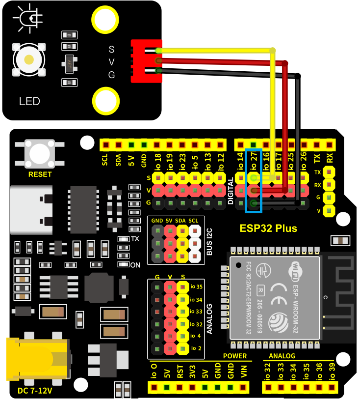
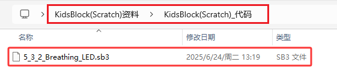
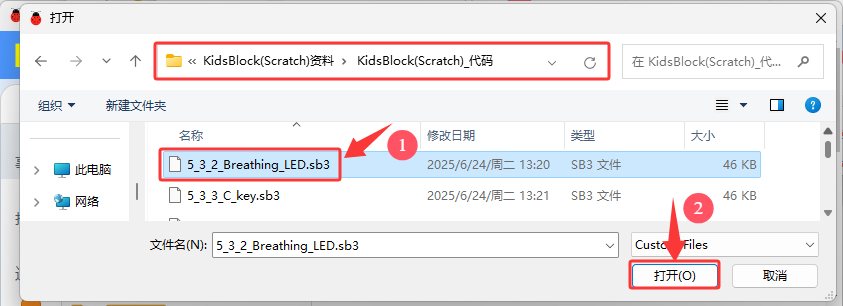
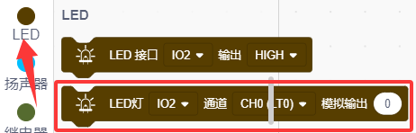
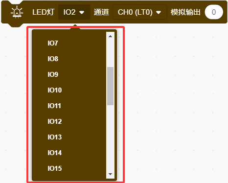
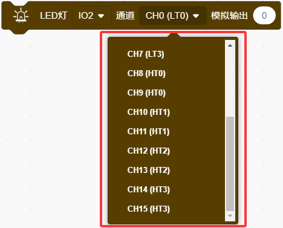
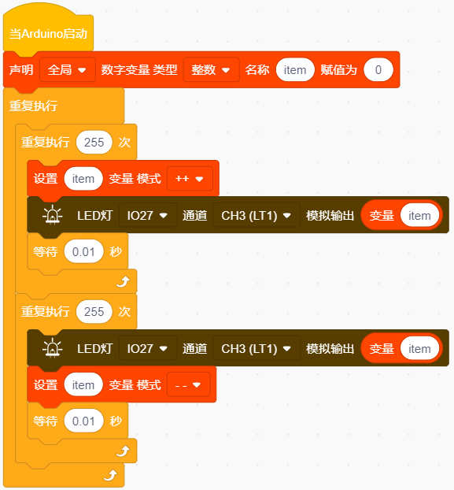
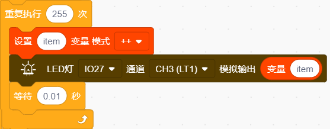
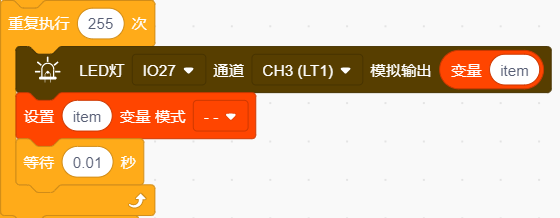

### 5.3.2 LED灯调节亮度

#### 5.3.2.1 简介

本课程将引导您深入了解如何利用脉宽调制（PWM）技术来调节LED灯的亮度。PWM是一种通过快速切换电源来改变LED亮度的高效方法，它通过调整信号的占空比来控制LED的平均电流，从而实现亮度的无级调节。课程内容包括PWM原理、电路设计、编程实现及实际应用案例，旨在帮助学员掌握LED亮度控制的核心技术，并能够应用于各种电子项目中。

#### 5.3.2.2 元件知识

**模拟信号** 与 **数字信号**

模拟信号在时间和数值上都是连续的。相反，数字信号或离散时间信号是由一系列数值组成的时序序列。生活中大多数信号都是模拟信号。一个常见的模拟信号的例子是：一天中的温度会持续变化，不可能突然从 0℃ 突然跃升至 10℃。然而，数字信号能够瞬间改变数值。这种变化以数字形式表示为 1 和 0（这是二进制代码的基础）。当将其绘制成如下图表并进行比较时，其差异会更加明显。

一个常见的模拟信号的例子是：一天中的温度会持续变化，不可能突然从 0℃ 突然跃升至 10℃。然而，数字信号则不同。在实际应用中，我们通常使用二进制作为数字信号，即一系列的 0 和 1。由于二进制信号只有两种值（0 或 1），所以它具有极高的稳定性和可靠性。最后，模拟信号和数字信号都可以相互转换。

**PWM**

PWM，即脉宽调制，是一种利用数字信号来控制模拟电路的非常有效的方法。普通的处理器无法直接输出模拟信号。而PWM 技术则使得这种转换（**将数字信号转换为模拟信号**）变得非常便捷。

PWM 技术通过数字引脚发送特定频率的方波信号，即高电平和低电平的交替输出，每次交替持续一段时间。每组高电平和低电平的总时长通常是固定的，这被称为周期（**注意：周期的倒数即为频率**）。高电平输出的时间通常被称为“脉冲宽度”，而占空比则是脉冲持续时间（PW）与波形总周期（T）的比率所占的百分比。

高电平输出持续的时间越长，对应的占空比就越大，相应的模拟信号电压也就越高。以下图表展示了在 0V 至 5V 之间（高电平为 5V）模拟信号电压随脉冲宽度（0% - 100%）的变化情况：

脉宽调制的占空比越长，输出功率就越高。既然我们已经理解了这种关系，就可以利用脉宽调制来控制 LED 的亮度或直流电机的速度等等。

从上述内容可以看出，脉宽调制并非真正的模拟方式，电压的有效值相当于相应的模拟值。因此，我们可以控制 LED 和其他输出模块的输出功率，以实现不同的效果。

**ESP32** 和 **PWM**

在 ESP32 上，LEDC（PWM）控制器有 16 个独立通道，每个通道都可以独立控制频率、占空比，甚至精度。与传统的 PWM 引脚不同，ESP32 的 PWM 输出引脚是可配置的，每个通道有一个或多个 PWM 输出引脚。最大频率与位精度之间的关系如以下公式所示，其中位的最大值为 31 。

例如，生成一个具有 8 位精度的脉宽调制信号（2^8 = 256，数值范围从 0 到 255），其最大频率为 80，000，000 / 255 = 312，500 赫兹。

#### 5.3.2.3 接线图

- **LED模块的S引脚连接到io27**

⚠️ **特别注意：智慧农场已经组装好了，这里不需要把LED模块拆下来又重新组装和接线，这里再次提供接线图，是为了方便您编写代码！**

#### 5.3.2.4 实验代码

代码文件在`KidsBlock(Scratch)_代码`文件夹中，代码文件为`5_3_2_Breathing_LED.sb3`，如下图所示：

单击 “**文件**” --> “**从电脑中上传**”，然后选择保存代码的路径，选中代码文件打开即可，如下图所示：

**认识代码块**

① 这个代码块，表示当启动ESP32这块开发板时，将运行代码。

② 创建变量。

这是创建 “**变量**” 的指令方块，可以声明“全局”或“局部”，还可以设置变量的类型、名称和赋值，item是变量名称。

获取变量item。

设置变量item模式为每执行一次循环让item加1或每执行一次循环让item减1。 

③ 循环语句，顾名思义就是重复做一件事。

④ 有条件的循环控制语句，当满足循环次数时就退出循环，比如：10表示循环执行10次，数字10是可以改成其他数字的。
 

⑤ 向LED指定引脚设置输出PWM代码块，只需要设置对应的引脚，通道（一共有16个通道（0~15））和模拟输出数值，就可以输出PWM值）

⑥ 将程序的执行暂停一段时间，也就是延时。单位是秒。 

**组合代码块**

#### 5.3.2.5 实验结果

按照接线图接好线，外接电源，选择好正确的开发板板型（ESP32 Dev Module）和 适当的串口端口（COMxx），然后单击按钮上传代码。上传代码成功后，即可实现LED灯从暗慢慢变亮，然后再由亮慢慢变暗，以此循环的现象。  

#### 5.3.2.6 代码说明

（1）.将LED灯从暗慢慢变亮，也就是让变量item从0逐渐加1，共加255次。

（2）.将LED灯从亮慢慢变暗，也就是让变量item从255逐渐减1，共减255次。

