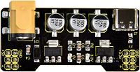
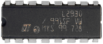
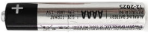
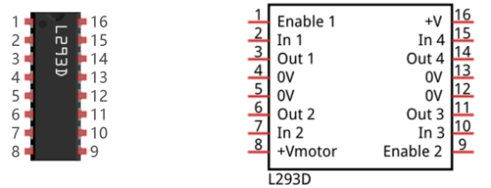
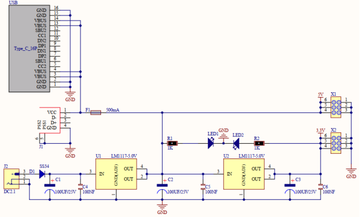
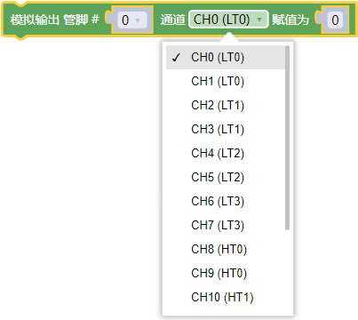
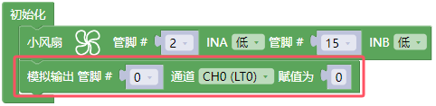
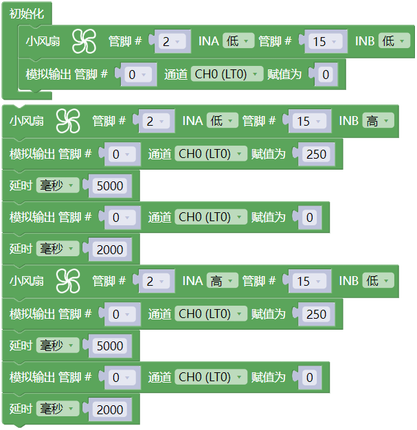
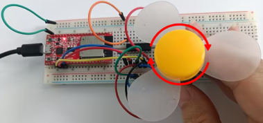

## 项目18 小风扇

**1.项目介绍：** 

在炎热的夏季，需要电扇来给我们降温，那么在这个项目中，我们将使用ESP32控制直流电机和小扇叶来制作一个小电扇。

**2.项目元件：**

||||||
| :--: | :--: | :--: | :--: | :--: |
|ESP32*1|面包板*1|直流电机*1|面包板专用电源模块*1|6节5号电池盒*1|
||||||
|IC L293D*1|风扇叶*1|跳线若干|5号电池(自备)*6|USB 线*1|

**3.元件知识:**

L293D芯片：L293D是一种直流电动驱动IC，在一些机器人项目中可用来驱动直流电机或步进电机。它共有16个引脚，可以同时驱动两路直流电机。输入电压范围：4.5 V ~ 36 V，每通道输出电流：MAX 600mA，可以驱动感性负载，特别是其输入端可以与主控板直接相连，从而很方便地受主控板控制。当驱动小型直流电机时，可以直接控制两路电机，并且可以实现电机正转与反转，实现此功能只需改变输入端的高低电平。市面上有许多采用L293D芯片的电机驱动板，当然我们也可以自己通过简单连接来使用它。

**L293D引脚图：**

|引脚号| 引脚名称 | 描述 |
| :--: | :--: | :--: |
| 1 | Enable1 | 该引脚使能输入引脚Input 1(2)和Input 2(7)  |
| 2 | In1 | 直接控制输出1引脚，由数字电路控制 |
| 3 | Out1 | 连接到电机1的一端 |
| 4 | 0V | 接地引脚连接到电路的接地(0V) |
| 5 | 0V | 接地引脚连接到电路的接地(0V) |
| 6 |Out2 | 连接到电机1的另一端 |
| 7 | In2 | 直接控制输出2引脚。由数字电路控制 |
| 8 | +V motor | 连接到运行电机的电压引脚(4.5V至36V) |
| 9 | Enable2 |该引脚使能输入引脚输入3(10)和输入4(15) |
| 10 | In3 | 直接控制输出3引脚。由数字电路控制|
| 11 | Out3 | 连接到电机2的一端 |
| 12 | 0V | 接地引脚连接到电路的接地(0V) |
| 13 | 0V | 接地引脚连接到电路的接地(0V) |
| 14 | Out4 | 连接到电机2的另一端 |
| 15 |In4 | 直接控制输出4引脚，由数字电路控制|
| 16 | +V | 连接到+ 5V以启用IC功能 |

**面包板专用电源模块：**

**说明：**

此模块，能方便的给面包板提供3.3V和5V的电源，具有DC2.1输入（DC7－12V），另外，具备USB Type C接口的电源输入。

**规格：** 

 输入电压：DC座：7-12V；  Type C USB：5V 

 电流：3.3V：最大500mA；        5V：最大500mA；

 最大功率: 2.5W

 尺寸: 53mmx26.3mm

 环保属性: ROHS

**接口说明：**

**原理图：**

**4.项目接线图：**

(注: 先接好线，然后在直流电机上安装一个小风扇叶片。)

**5.代码说明：**

这 2 个指令方块都可以用来设置直流电机(小风扇)不转。

设置直流电机(小风扇)逆时针转动。

设置直流电机(小风扇)顺时针转动。

设置ledc通道0，频率为1200，PWM分辨率为8，占空比为256；将ledc通道0绑定到指定的ENA_pwm引脚 IO0 进行输出。

**6.项目代码：**

你可以打开我们提供的代码，也可以自己编写代码，其如下：

1. 从 “” 拖出 “”。

2. 从 “” 拖出 “” 放入 “” ，INA 管脚为 2 ，INB管脚为 15 ，将 “高” 都改成 “低” 。

3. 从 “” 拖出 “” 放入 “” ，模拟输出管脚为 0 ，通道为 CHO(LT0) ，赋值为 0 。

4. 复制代码块 “” 1 次 ，将 INB 后面的 “低” 改成 “高”，模拟输出管脚 0 后面的赋值 0 改成 250 ；再从 “” 拖出 “”，设置延时为5000毫秒。

5. 复制代码块 “  ” 1 次，将 模拟输出管脚 0 后面的赋值 250 改成 0 ，延时5000毫秒改成2000毫秒。

6. 复制代码块 “” 1 次，将 INA “低” INB “高” 改成 INA “高” INB “低” ，其他的不变。

完整代码：

**7.项目现象：**

编译并上传代码到ESP32，代码上传成功后，外接电源，上电后，你会看到的现象是：小风扇先逆时针转5秒，停止2秒，再顺时针转5秒，停止2秒，以此规律重复执行。

